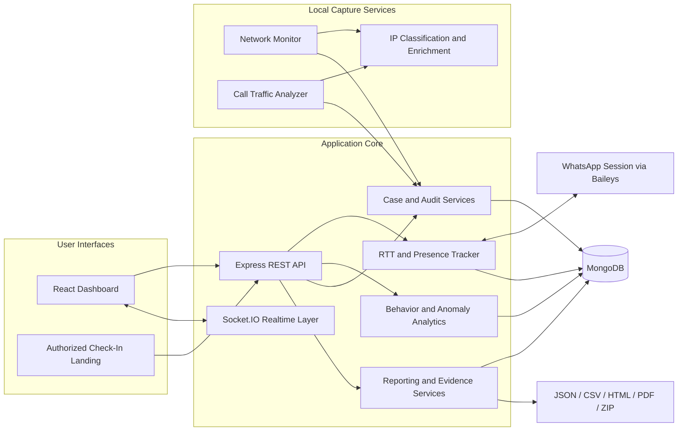
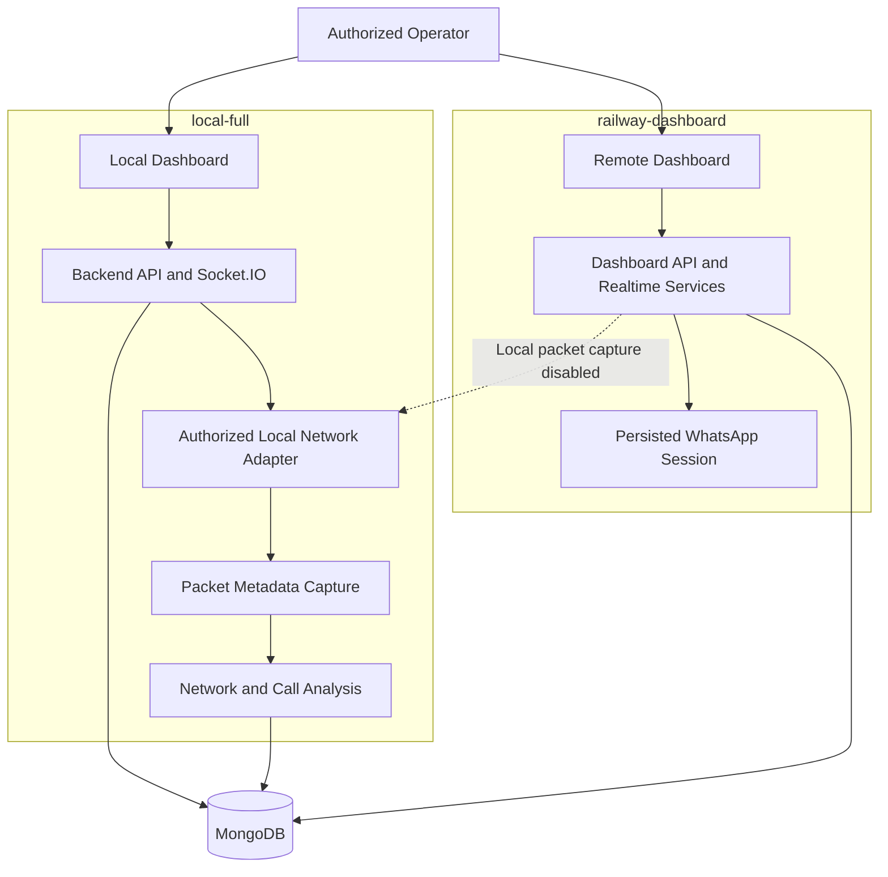
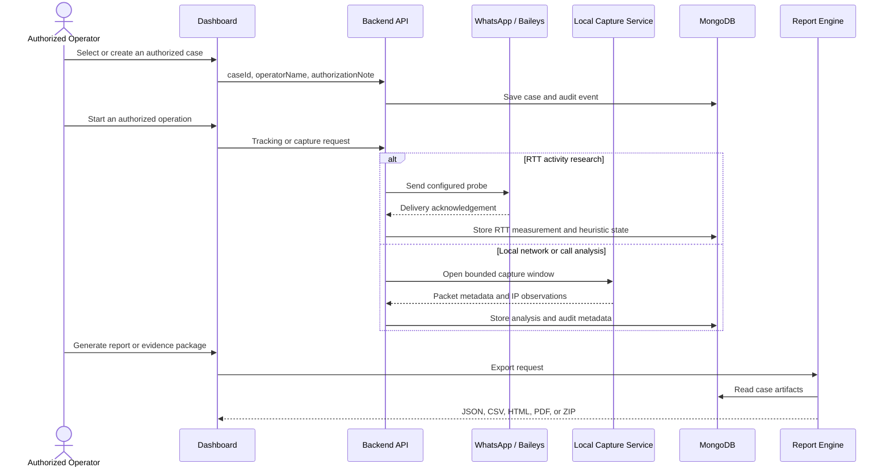

<h1 align="center">WP MONITOR</h1>

<p align="center">
  <strong>Authorized WhatsApp Activity Research, Network Metadata Analysis, Case Auditing, and Evidence-Oriented Reporting</strong>
</p>

<p align="center">
  <a href="CHANGELOG.md">
    
  </a>
  
  
  
  
  
  
  
  <a href="LICENSE">
    
  </a>
</p>

<p align="center">
  <a href="#overview">Overview</a> ·
  <a href="#architecture">Architecture</a> ·
  <a href="#quick-start">Quick Start</a> ·
  <a href="#configuration">Configuration</a> ·
  <a href="#api-reference">API Reference</a> ·
  <a href="#ethical-and-legal-use">Ethical and Legal Use</a>
</p>

> ⚠️ **Authorized use only.** WP MONITOR is an experimental proof of concept for defensive research, training, digital forensics, and controlled laboratory environments. Do not monitor people, accounts, devices, communications, or network traffic without explicit authorization. RTT states, network observations, candidate IP addresses, GeoIP data, and consistency scores do not prove identity, exact physical location, or ownership by a person.

---

## Overview

WP MONITOR is an open-source research platform that combines WhatsApp activity analysis, behavioral analytics, local network metadata capture, consent-based check-ins, case management, audit logging, and evidence-oriented reporting.

The project was originally forked from [gommzystudio/device-activity-tracker](https://github.com/gommzystudio/device-activity-tracker) and extensively redesigned by [deco31416](https://www.deco31416.com). The v2.x architecture adds MongoDB persistence, contact history and auto-restore, a human-readable activity bitácora, JSON/HTML/PDF reporting, behavior intelligence, local packet metadata analysis, call-window analysis, case records, audit exports, evidence packages, and separate local and Railway runtime modes.

The RTT research foundation follows the paper **“Careless Whisper: Exploiting Silent Delivery Receipts to Monitor Users on Mobile Instant Messengers”** by Gabriel K. Gegenhuber et al. from the University of Vienna and SBA Research.

### Intended users

- Authorized security researchers
- Digital forensics teams and authorized technical investigators
- Academic and controlled laboratory environments
- Developers evaluating messaging metadata exposure
- Operators managing consent-based technical investigations

### Core capabilities

| Area | Capability |
|---|---|
| Activity analysis | Measures delivery-receipt round-trip time and derives heuristic `online`, `standby`, and `offline` states |
| Activity log | Converts technical state transitions into a paginated, human-readable bitácora with local and UTC timestamps |
| Behavior intelligence | Calculates routines, availability probability, session statistics, weekly heatmaps, habit profiles, and multi-contact correlations |
| Presence and device signals | Observes supported presence states, recording/typing indicators, device changes, and RTT-based connection-type inference |
| Privacy and anomaly assessment | Produces an explainable OPSEC exposure score and flags deviations from historical activity baselines |
| Network Monitor | Captures packet metadata through Npcap/libpcap, applies protocol filters, classifies IP observations, and exports CSV or JSON |
| Call traffic analysis | Opens an authorized local capture window around an externally initiated WhatsApp Web/Desktop call or interaction |
| Authorized Check-In | Creates consent-based links that record server-observed network metadata, browser/device context, optional GPS, and a SHA-256 evidence hash |
| Case and audit management | Associates operations with a `caseId`, operator, authorization note, event timeline, and case status |
| Reporting and evidence | Generates contact reports, final case reports, audit exports, CSV annexes, and JSON/ZIP evidence packages with integrity hashes |
| Runtime separation | Supports `local-full` for local capture and `railway-dashboard` for remote dashboard, API, statistics, and reporting |
| Operational controls | Exposes health and capability endpoints, token protection, production CORS controls, rate limits, and safe feature gating |

---

## Architecture

### System architecture



### Runtime deployment model



`railway-dashboard` cannot inspect the operator’s local network adapter. Packet capture and call-window analysis must run in `local-full` on the authorized machine, VM, VPS, or laboratory host where the relevant traffic is visible.

### Authorized operational workflow



---

## Interpretation and Technical Limits

WP MONITOR intentionally uses conservative terminology. Its outputs are investigative aids and research observations, not conclusive attribution.

| Output | Correct interpretation |
|---|---|
| RTT state | A heuristic activity state derived from measured response timing |
| Presence signal | A supported session event observed through the current WhatsApp/Baileys integration |
| Candidate IP | A public IP observed during an authorized capture window and prioritized for manual review |
| Infrastructure IP | A known or likely relay, CDN, cloud, hosting, STUN/TURN, Meta/WhatsApp, Google, or other provider address |
| GeoIP result | An approximate network/provider registration or routing hint; not GPS and not verified physical location |
| Optional GPS | Client-declared browser location available only after explicit permission during an Authorized Check-In |
| Consistency score | An explainable correlation of network and browser signals; not proof of identity or fraud |
| SHA-256 hash | An integrity reference for exported data; it does not independently prove the truth or origin of the underlying observation |

Results can be affected by VPNs, proxies, carrier-grade NAT, mobile networks, CDNs, cloud relays, firewalls, routing changes, shared IP addresses, inaccurate third-party data, platform updates, and incomplete packet samples. The software may produce false positives, false negatives, incomplete results, or no result at all.

---

## Feature Details

### Activity tracking and contact history

- Real-time RTT measurement from supported delivery acknowledgements
- Dynamic threshold-based state classification
- Historical chart backed by MongoDB, including the latest 200 measurements on initial load
- Delete and reaction probe methods
- QR authentication through Baileys
- Contact profile enrichment, custom aliases, and display precedence
- Soft-delete contact history, one-click reactivation, and automatic restoration of active contacts

### Activity bitácora and reports

- Human-readable state timeline with local and UTC timestamps
- Paginated event table with loading states and visual state differentiation
- Bitácora export to JSON, HTML, and PDF
- Full contact report with profile, statistics, patterns, measurements, history, and executive summary
- Case-level final reports in JSON, HTML, and native PDF

### Behavior intelligence

- Daily routine estimation
- Twenty-four-hour availability probability curve
- Session count, average, median, maximum, and intensity score
- Seven-day by twenty-four-hour activity heatmap
- Habit profile classification and timezone inference
- Multi-contact Pearson correlation, simultaneous activity, and follow-delay analysis
- REST access through the `/api/intel/*` routes implemented by the project

### Presence, device, privacy, and anomaly signals

- Supported typing and recording presence events
- New-device observation and device-count changes
- RTT variance analysis for Wi-Fi versus cellular inference
- Explainable privacy/OPSEC exposure score from `0` to `100`
- Historical-baseline anomaly checks for unusual hours, long sessions, nocturnal behavior, low consistency, and weekday/weekend shifts

### Network Monitor

- Npcap/libpcap packet metadata capture without payload inspection
- TCP, UDP, ICMP, port, and IP BPF filters
- Real-time packet table and operational statistics
- CSV and JSON export
- Required `caseId`, operator, and authorization note for manual capture
- Backend-generated `ipInsights` rather than frontend-only heuristics
- Conservative classification of private/local ranges, infrastructure, preliminary public candidates, and weak observations requiring review
- Optional filters that hide known infrastructure or local traffic without modifying the original exportable capture

### Call traffic analysis

WP MONITOR does not programmatically initiate or control WhatsApp calls. The authorized operator starts the call or interaction from WhatsApp Web/Desktop on the same machine; the local service observes the bounded traffic window.

The call-analysis view can include:

- Local host, network/ISP path, provider infrastructure, relays, and public IP observations
- Explainable candidate scoring from `0` to `100`
- Packet counts, ports, directions, and reason codes
- DB-IP-first enrichment with optional `ip-api` complement
- ISP, organization, ASN, mobile/proxy/hosting flags, and approximate network coordinates when available
- Automatic demotion of CDN, cloud, hosting, or proxy infrastructure after enrichment
- Persistent analysis history by `callId`

Candidate scoring is deliberately limited by sample size, directionality, infrastructure detection, and other correlation constraints. An observed address must never be presented as a verified person’s IP or exact location.

### Authorized Check-In

- Case-bound, consent-based public links
- Editable title, description, branding, layout, colors, and completion behavior
- Explicit acceptance before submission
- Server-observed IP, user agent, language, timezone, device type, operating system, browser, screen, viewport, and supported browser network hints
- Optional GPS only when the user grants browser permission
- Optional IP enrichment and Maps links
- Explainable consistency score
- SHA-256 evidence hash and case timeline association
- Audit events for creation, completion, editing, revocation, and administrative deletion
- Per-IP and per-token/IP rate limiting
- Socket.IO updates with a polling fallback

### Cases, audit trail, and evidence

- Formal case records with `draft`, `authorized`, `active`, `closed`, and `archived` states
- Capture rejection for closed or archived cases
- Required operator and authorization context
- UTC timestamps and case-linked audit events
- Timeline and technical-table views with filters, search, and pagination
- JSON audit export with SHA-256 hash
- Evidence package in JSON or ZIP
- Spreadsheet-ready CSV annexes and per-file integrity hashes
- Direct case links for contacts, network captures, call analyses, check-ins, and generated reports

---

## Technology Stack

| Layer | Technology |
|---|---|
| Runtime | Node.js 20+ (Node.js 22 recommended), TypeScript 5.7 |
| Backend | Express 5, Socket.IO 4.8 |
| Frontend | React 19, Tailwind CSS 3.4, Recharts 3.5, Lucide React |
| Database | MongoDB 7.1, local or Atlas |
| WhatsApp integration | `@whiskeysockets/baileys` from GitHub |
| Packet capture | `cap` 0.2.1 with Npcap/libpcap |
| Offline geolocation | `geoip-lite` 2.0 |
| Optional IP enrichment | DB-IP with `ip-api` complement |
| Package manager | pnpm 10 workspace for backend and frontend |
| Packaging and deployment | Docker Compose, local runtime, Railway dashboard mode |

### Dependency audit status

The project keeps backend and frontend lockfiles and uses compatible overrides for patched transitive dependencies. The frontend production audit is clean in the documented hardening pass; remaining frontend development advisories are associated with Create React App development tooling and should be resolved through a controlled Vite migration rather than an incompatible forced upgrade.

The backend retains upstream/transitive risk through the WhatsApp dependency chain, including Baileys-related libraries. Upgrades should be tested on a compatibility branch with QR authentication, contact restoration, call capture, reporting, Railway mode, and local packet-capture smoke tests before promotion.

---

## Quick Start

### Prerequisites

- Node.js `20+`
- pnpm `10+`
- MongoDB, local or Atlas
- A WhatsApp account for QR authentication
- Npcap on Windows when using Network Monitor or local call analysis
- Administrator/root permissions for packet capture

On Windows, install Npcap with **WinPcap API-compatible Mode** enabled.

### Clone and install

```bash
git clone https://github.com/deco31416/wp-monitor.git
cd wp-monitor

pnpm install

cp .env.example .env
```

Edit `.env` before starting the application.

### Recommended local startup

From PowerShell or the VS Code terminal:

```powershell
pnpm run dev:local
```

The command opens visible backend and frontend terminals:

| Service | Address |
|---|---|
| Backend | `http://127.0.0.1:4000` |
| Frontend | `http://127.0.0.1:4001` |
| Health check | `http://127.0.0.1:4000/api/health` |

Runtime logs are written to:

```text
.runtime-logs/backend-local.log
.runtime-logs/frontend-local.log
```

Safe local controls:

```powershell
pnpm run dev:local -- -Status
pnpm run dev:local -- -Restart
```

The direct `scripts/start-local.ps1` entry point does not launch services unless `-Start` or `-Restart` is provided.

### Manual startup

```bash
# Terminal 1
# Administrator/root privileges are required for packet capture.
pnpm run start:server

# Terminal 2
pnpm run start:client
```

### Docker Compose

```bash
cp .env.example .env
docker compose up --build
```

The containerized defaults expose the frontend on `4001`, the backend on `4000`, and persist WhatsApp authentication at `/app/auth_info_baileys`.

---

## Configuration

### Environment variables

<details>
<summary>Show the complete example configuration</summary>

```env
# Server and frontend
BACKEND_PORT=4000
CLIENT_PORT=4001
BACKEND_URL=http://127.0.0.1:4000
ALLOWED_ORIGINS=http://localhost:4001,http://127.0.0.1:4001
PUBLIC_BASE_URL=http://127.0.0.1:4000

# MongoDB
MONGODB_URI=mongodb://localhost:27017
MONGODB_DB=device-tracker

# Runtime mode
NODE_ENV=development
DEPLOYMENT_MODE=local-full
LOCAL_CAPTURE_ENABLED=true

# Optional locally; required in production. Use at least 32 characters.
# DASHBOARD_TOKEN=change-this-long-random-token-with-32-plus-chars

# Client IP handling
# Local default: false
# Railway default: one trusted proxy hop
# TRUST_PROXY=false

# Public Check-In submit rate limits
# CHECKIN_SUBMIT_RATE_WINDOW_MS=600000
# CHECKIN_SUBMIT_RATE_MAX_PER_IP=60
# CHECKIN_SUBMIT_RATE_MAX_PER_TOKEN_IP=8

# Swagger/OpenAPI; never registered in production
ENABLE_SWAGGER=false

# Optional call-analysis IP enrichment
ENABLE_IP_ENRICHMENT=true
IP_ENRICHMENT_PRIMARY_PROVIDER=db-ip
DB_IP_API_KEY=free
IP_ENRICHMENT_CACHE_TTL_SEC=604800
IP_ENRICHMENT_TIMEOUT_MS=3500

# Optional default audit context
DEFAULT_CASE_ID=CASE-2026-001
DEFAULT_OPERATOR_NAME=Authorized operator
DEFAULT_AUTHORIZATION_NOTE=Authorization reference
```

</details>

### Runtime modes

| Variable | Local full mode | Railway dashboard mode |
|---|---|---|
| `DEPLOYMENT_MODE` | `local-full` | `railway-dashboard` |
| `LOCAL_CAPTURE_ENABLED` | `true` | `false` |
| Local adapter access | Available with OS privileges | Not available |
| Network Monitor | Enabled | Disabled |
| Call traffic analysis | Enabled | Disabled |
| Dashboard, API, reports, audit | Enabled | Enabled |

### Swagger / OpenAPI

Swagger UI is available only when both conditions are satisfied:

```env
ENABLE_SWAGGER=true
NODE_ENV!=production
```

Local route:

```text
http://127.0.0.1:4000/docs
```

The `/docs` route is not registered in production.

### Railway dashboard deployment

Use Railway for the dashboard, API, statistics, reports, audit lookup, and persisted WhatsApp session. Do not treat Railway as a local packet-capture host.

```env
DEPLOYMENT_MODE=railway-dashboard
LOCAL_CAPTURE_ENABLED=false
NODE_ENV=production
PORT=4000
MONGODB_URI=mongodb+srv://...
MONGODB_DB=activity-tracker
ALLOWED_ORIGINS=https://your-frontend.up.railway.app
DASHBOARD_TOKEN=change-this-long-random-token-with-32-plus-chars
TRUST_PROXY=1
PUBLIC_BASE_URL=https://your-backend.up.railway.app
```

Attach persistent Railway volumes to:

```text
/app/auth_info_baileys
/app/public/uploads
```

The first volume preserves WhatsApp authentication. The second preserves Authorized Check-In preview assets across restarts and redeployments.

See [docs/operations/railway.md](docs/operations/railway.md) for the deployment checklist.

---

## Usage

### Recommended workflow

1. Confirm written or otherwise valid authorization for the account, device, traffic, or case.
2. Start `local-full` when local packet metadata is required, or `railway-dashboard` for remote dashboard and reporting functions.
3. Open the dashboard and provide the configured `DASHBOARD_TOKEN` when enabled.
4. Authenticate the project session through the WhatsApp QR flow.
5. Create or select a case and provide `caseId`, `operatorName`, and `authorizationNote` before manual capture.
6. Add an authorized contact and review RTT measurements, state history, profile data, statistics, and behavior analytics.
7. For call analysis, start the WhatsApp Web/Desktop call outside WP MONITOR on the same authorized host, then open and close the bounded local capture window.
8. Review candidate and infrastructure classifications conservatively.
9. Export contact reports, final case reports, audit data, or evidence packages as required.
10. Stop tracking and close or archive the case when the authorized work is complete.

### Production authentication

When `DASHBOARD_TOKEN` is set:

- REST requests require `Authorization: Bearer <token>`.
- Socket.IO clients must send the same token in the authentication payload.
- Dashboard access and protected download links use the same control.
- `DASHBOARD_TOKEN` is required when `NODE_ENV=production`.

---

## API Reference

### Runtime, health, audit, evidence, and reports

| Method | Endpoint | Description |
|---|---|---|
| `GET` | `/api/runtime-capabilities` | Returns public runtime capability flags for dashboard/local mode |
| `GET` | `/api/health` | Returns operational or degraded status without exposing secrets |
| `GET` | `/api/audit/:caseId` | Returns audit events for a case |
| `GET` | `/api/audit/:caseId/export` | Exports audit JSON with a SHA-256 hash |
| `GET` | `/api/evidence/:caseId/package` | Exports the JSON evidence package |
| `GET` | `/api/evidence/:caseId/package.zip` | Exports a ZIP evidence package with separated artifacts |
| `GET` | `/api/reports/:caseId/final` | Exports the final case report as JSON |
| `GET` | `/api/reports/:caseId/final.html` | Exports the final case report as HTML |
| `GET` | `/api/reports/:caseId/final.pdf` | Exports the final case report as PDF |

<details>
<summary>Case management endpoints</summary>

| Method | Endpoint | Description |
|---|---|---|
| `GET` | `/api/cases` | Lists cases, optionally filtered by status |
| `POST` | `/api/cases` | Creates or updates a formal case record |
| `GET` | `/api/cases/:caseId` | Returns one case |
| `PATCH` | `/api/cases/:caseId` | Updates case metadata or status |
| `POST` | `/api/cases/:caseId/close` | Closes a case and records an audit event |
| `GET` | `/api/cases/:caseId/evidence` | Lists direct evidence links for a case |

</details>

<details>
<summary>WhatsApp tracker endpoints</summary>

| Method | Endpoint | Description |
|---|---|---|
| `GET` | `/api/contacts` | Lists active tracked contacts |
| `GET` | `/api/contacts/history` | Lists active and inactive saved contacts |
| `GET` | `/api/history/:jid` | Returns RTT measurement history |
| `GET` | `/api/activity/:jid` | Returns state transition history |
| `GET` | `/api/stats/:jid` | Returns online, standby, and offline distribution |
| `GET` | `/api/profile/:jid` | Returns stored and live profile data |
| `GET` | `/api/patterns/:jid` | Returns hourly activity patterns |
| `GET` | `/api/report/:jid` | Generates the comprehensive contact report |
| `GET` | `/api/report/:jid/download` | Downloads the contact report |
| `GET` | `/api/privacy-score/:jid` | Returns the explainable OPSEC exposure score |
| `GET` | `/api/anomalies/:jid` | Returns historical-baseline anomaly findings |

</details>

<details>
<summary>Network Monitor endpoints</summary>

| Method | Endpoint | Description |
|---|---|---|
| `GET` | `/api/network/interfaces` | Lists available network interfaces |
| `GET` | `/api/network/status` | Returns capture status and statistics |
| `GET` | `/api/network/packets` | Returns up to 2,000 recent packet metadata entries |
| `GET` | `/api/network/export/json` | Exports packet metadata as JSON |
| `GET` | `/api/network/export/csv` | Exports packet metadata as CSV |

</details>

<details>
<summary>Call traffic analysis endpoints</summary>

| Method | Endpoint | Description |
|---|---|---|
| `GET` | `/api/call-analysis/:jid` | Returns the latest call traffic analysis for a contact |
| `GET` | `/api/call-history/:jid` | Returns call-analysis history for a contact |
| `GET` | `/api/call-capture/status` | Returns current call-capture status |
| `POST` | `/api/call-capture/start` | Starts a bounded manual capture with audit metadata |
| `POST` | `/api/call-capture/stop` | Stops the current manual capture and runs analysis |

</details>

### Socket.IO events

<details>
<summary>Show realtime event contracts</summary>

| Event | Direction | Description |
|---|---|---|
| `add-contact` | Client to server | Starts tracking an authorized phone number |
| `remove-contact` | Client to server | Stops tracking and soft-deletes the contact |
| `reactivate-contact` | Client to server | Reactivates a saved contact |
| `get-tracked-contacts` | Client to server | Requests active trackers |
| `set-probe-method` | Client to server | Changes the delete/reaction probe method |
| `tracker-update` | Server to client | Sends real-time RTT and state data |
| `contact-added` | Server to client | Confirms a contact was added |
| `contact-profile` | Server to client | Sends enriched profile data |
| `network-start` | Client to server | Starts authorized network capture |
| `network-stop` | Client to server | Stops network capture |
| `network-packet` | Server to client | Sends a newly captured packet metadata entry |
| `start-call-capture` | Client to server | Starts call-window capture with audit metadata |
| `stop-call-capture` | Client to server | Stops call-window capture |
| `call-capture-started` | Server to client | Confirms capture start |
| `call-capture-stopped` | Server to client | Returns the completed analysis |
| `call-packet` | Server to client | Sends a packet observed during the call window |
| `presence-change` | Server to client | Sends supported composing, recording, or availability changes |
| `device-alert` | Server to client | Reports a newly observed device |

</details>

---

## How It Works

### RTT activity analysis

The tracker sends the configured probe and measures the interval until the supported client acknowledgement is observed.

| Probe method | Description |
|---|---|
| Delete | Sends a delete request referencing a non-existent message identifier |
| Reaction | Sends a reaction referencing a non-existent message identifier |

The project calculates a dynamic threshold from the median RTT. Measurements below or above that threshold contribute to heuristic activity-state classification. These states depend on current platform behavior and must not be treated as direct proof that a person is actively using a device.

### Network packet metadata pipeline

```mermaid
flowchart LR
    Adapter[Authorized Network Adapter]
    Capture[Npcap / libpcap Capture]
    Decode[IPv4 and TCP/UDP Metadata Decode]
    Filter[BPF and Runtime Filters]
    Classify[Infrastructure and Candidate Classification]
    Enrich[Optional IP Enrichment]
    Stream[Socket.IO Stream]
    Store[Case Audit and MongoDB]
    Export[CSV / JSON]

    Adapter --> Capture --> Decode --> Filter --> Classify
    Classify --> Enrich
    Classify --> Stream
    Enrich --> Stream
    Stream --> Store
    Store --> Export
```



Only packet metadata is analyzed by this module; payload/content inspection is outside the documented design.

### Evidence package

A case evidence package can include:

- Manifest with software version, generation timestamp, case identifier, and limitations
- Case record and direct evidence links
- Audit events
- Call analyses linked through audited `callId` values
- Activity statistics and coverage/reliability information
- Network summary derived from capture audit events
- Final report artifacts
- SHA-256 hash per section and package-level integrity hash
- CSV annexes for audit events, evidence links, call analyses, candidate IP observations, activity statistics, and network captures

Expected ZIP artifacts include:

```text
manifest.json
case.json
audit.json
evidence-links.json
call-analysis.json
network-summary.json
final-report.json
final-report.html
final-report.pdf
integrity.json
full-package.json
annexes/
```

Report and evidence QA fixtures can be generated with:

```bash
pnpm run qa:report-fixture
```

The fixture checks required report sections, PDF generation, ZIP contents, integrity metadata, technical limitations, product branding, and visible placeholder leakage.

---

## Reports and Exports

| Export | Scope | Includes | Recommended use |
|---|---|---|---|
| Activity Bitácora JSON/HTML/PDF | One contact and its activity timeline | State changes, local/UTC timestamps, RTT, readable descriptions, activity summary | Fast chronological review |
| Full Contact Report | One contact | Profile, RTT statistics, state distribution, behavior patterns, history, measurements, executive summary | Technical contact-level review |
| Call Analysis History | One contact | Capture windows, route view, packet counts, infrastructure, candidate scoring, GeoIP/provider hints, limitations | Review of authorized local call/interaction captures |
| Final Case Report JSON/HTML/PDF | Entire case | Case record, authorization, audit timeline, evidence links, activity statistics, call analyses, IP observations, hashes, limitations | Formal case-level reporting |
| Evidence Package JSON/ZIP | Entire case and archival artifacts | Manifest, case, audit, evidence links, analyses, reports, CSV annexes, SHA-256 integrity metadata | Chain-of-custody archive and external review |

The Full Contact Report and Final Case Report are different products. The contact report summarizes one authorized contact inside the tracker; the final case report consolidates the broader case, including audit events, check-ins, local captures, call analyses, evidence links, and integrity metadata.

---

## Project Structure

<details>
<summary>Show the main repository structure</summary>

```text
wp-monitor/
├── src/
│   ├── server.ts
│   ├── tracker.ts
│   ├── packet-capture.ts
│   ├── call-analyzer.ts
│   ├── call-scoring.ts
│   ├── check-in.ts
│   ├── analytics.ts
│   ├── runtime.ts
│   ├── ip-enrichment.ts
│   ├── meta-ip-ranges.ts
│   ├── db.ts
│   ├── evidence-package.ts
│   ├── routes/
│   │   ├── audit.ts
│   │   ├── cases.ts
│   │   ├── reports.ts
│   │   └── runtime.ts
│   └── types/
│       └── cap.d.ts
├── client/
│   ├── src/
│   │   ├── App.tsx
│   │   ├── auth.ts
│   │   ├── types.ts
│   │   └── components/
│   │       ├── Dashboard.tsx
│   │       ├── Login.tsx
│   │       ├── ContactCard.tsx
│   │       ├── NetworkMonitor.tsx
│   │       ├── CallAnalysisPanel.tsx
│   │       ├── CheckIns.tsx
│   │       ├── Cases.tsx
│   │       └── AuditTrail.tsx
│   ├── tailwind.config.js
│   └── package.json
├── docs/
│   ├── getting-started/
│   ├── architecture/
│   ├── user-guide/
│   ├── operations/
│   ├── security/
│   ├── development/
│   ├── reference/
│   └── adr/
├── scripts/
├── CHANGELOG.md
├── .env.example
├── docker-compose.yml
├── Dockerfile
├── LICENSE
└── package.json
```

</details>

---

## Documentation

| Document | Purpose |
|---|---|
| [docs/README.md](docs/README.md) | Complete documentation portal by audience and task |
| [docs/AI_ENGINEERING_PROTOCOL.md](docs/AI_ENGINEERING_PROTOCOL.md) | Evidence-driven workflow for discovery, changes, reviews and releases |
| [docs/getting-started/README.md](docs/getting-started/README.md) | Installation, validation, first start, health and QR |
| [docs/architecture/README.md](docs/architecture/README.md) | System context, components, data, events and trust boundaries |
| [docs/diagrams/README.md](docs/diagrams/README.md) | Catalog of system, deployment, security, data and runtime Mermaid diagrams |
| [docs/user-guide/README.md](docs/user-guide/README.md) | Cases, Tracker, Network Monitor, Check-In, Audit and reports |
| [docs/operations/README.md](docs/operations/README.md) | Local, Docker, Railway, backup, recovery and troubleshooting |
| [docs/security/README.md](docs/security/README.md) | Security model, privacy, responsible use and evidence |
| [SECURITY.md](SECURITY.md) | Private vulnerability reporting and disclosure policy |
| [docs/development/README.md](docs/development/README.md) | Development workflow, API contracts and quality controls |
| [CHANGELOG.md](CHANGELOG.md) | Complete version history |

---

## Security and Data Handling

- Use `DASHBOARD_TOKEN` for every production deployment.
- Restrict `ALLOWED_ORIGINS` to the actual frontend origins.
- Configure `TRUST_PROXY` only for the known reverse-proxy topology.
- Use HTTPS for every public deployment and every externally shared Authorized Check-In URL.
- Keep MongoDB credentials, dashboard tokens, DB-IP keys, and other secrets outside version control.
- Never commit `auth_info_baileys/`, packet captures, generated reports, audit exports, uploaded check-in assets, or evidence packages.
- Run local packet capture only with the minimum required OS privileges and only on an authorized interface.
- Treat SHA-256 values as integrity references, not proof that collected information is accurate or legally admissible.
- Review upstream dependency advisories before production upgrades and validate WhatsApp session compatibility on a separate branch.
- Report security vulnerabilities privately rather than publishing exploitable details in a public issue.

### Defensive guidance

The project demonstrates metadata exposure described in the cited research. Users should independently validate current WhatsApp behavior because platform changes can alter or remove the observed conditions.

For network privacy, a properly configured VPN can reduce direct network exposure by tunneling traffic, but it does not guarantee protection against every form of metadata correlation.

---

## Troubleshooting

| Problem | Resolution |
|---|---|
| WhatsApp session does not connect | Remove the stale `auth_info_baileys/` directory and scan a new QR code |
| Baileys returns HTTP 405 | Install the documented GitHub version rather than an incompatible npm release |
| Packet capture does not start | Run with administrator/root privileges and verify Npcap WinPcap compatibility mode on Windows |
| Network Monitor is hidden | Confirm `DEPLOYMENT_MODE=local-full` and `LOCAL_CAPTURE_ENABLED=true` |
| API returns `401 Unauthorized` | Provide the configured `DASHBOARD_TOKEN` in the dashboard or Bearer header |
| Call analysis contains no useful packets | Confirm the WhatsApp Web/Desktop interaction runs on the same host and selected interface |
| Railway captures no local traffic | Expected behavior; Railway mode has no access to the operator’s local adapter |
| Dependency installation is inconsistent | Use pnpm 10 and run `pnpm install` from the repository root so the workspace installs backend and frontend together |
| MongoDB connection fails | Validate `MONGODB_URI`, credentials, network access, and Atlas allow-list settings |
| Contact does not auto-restore | Confirm the contact remained active rather than being manually stopped before restart |

---

## Release Highlights

### v2.9.4

- Automatically rotates stale Baileys sessions that close with `401/loggedOut`, allowing a fresh QR flow
- Uses UTF-8 local terminal output and suppresses misleading frontend deprecation noise

### v2.9.3

- Adds one-command local startup on ports `4000/4001`
- Adds VS Code tasks for separate backend and frontend terminals
- Writes local runtime logs under `.runtime-logs/`

### v2.9.2

- Moves Network Monitor IP intelligence to backend-generated `ipInsights`
- Separates local/private ranges, known infrastructure, preliminary public candidates, and weak observations
- Improves IP review cards and capture-table behavior

See [CHANGELOG.md](CHANGELOG.md) for the complete history from v2.0.0 onward.

---

## Research Basis and Citation

WP MONITOR builds on the research by Gegenhuber et al. from the University of Vienna and SBA Research.

```bibtex
@inproceedings{gegenhuber2024careless,
  title={Careless Whisper: Exploiting Silent Delivery Receipts to Monitor Users on Mobile Instant Messengers},
  author={Gegenhuber, Gabriel K. and G{\"u}nther, Maximilian and Maier, Markus and Judmayer, Aljosha and Holzbauer, Florian and Frenzel, Philipp {\'E}. and Ullrich, Johanna},
  year={2024},
  organization={University of Vienna, SBA Research}
}
```

Behavior-intelligence features also reference the research framing documented in the existing project for routine and activity inference.

---

## Ethical and Legal Use

WP MONITOR must be used only in environments where the operator has explicit authorization or another valid legal basis for the specific activity performed.

The project is not intended to support:

- Unauthorized surveillance or tracking
- Stalking, harassment, intimidation, or coercion
- Interception of communications without lawful authority
- Unauthorized account, device, or network access
- Identification or exact geolocation claims based only on IP observations
- Decisions that treat experimental output as conclusive legal, investigative, employment, financial, or personal evidence
- Violations of privacy, data-protection, telecommunications, computer-misuse, or platform rules

The software is experimental and may fail, become incompatible with third-party services, produce inaccurate results, or stop working after platform changes. Every operator is responsible for applicable laws, authorization records, data minimization, retention, access control, interpretation, and disclosure.

The software is provided under the warranty and liability limitations stated in the MIT License. No documentation, score, map, report, or export removes the user’s responsibility for lawful and ethical operation.

This project is independent and is not affiliated with, endorsed by, or sponsored by WhatsApp or Meta. Product and company names are used only to describe the project’s technical context and interoperability.

---

## Author and Professional Support

**deco31416**
Website: [www.deco31416.com](https://www.deco31416.com)
Email: [deco31416@gmail.com](mailto:deco31416@gmail.com)

The v2.x redesign, MongoDB integration, Network Monitor, case and audit architecture, report system, evidence exports, deployment split, and user-interface overhaul were developed by deco31416.

Professional support, authorized integrations, deployment assistance, architecture consulting, maintenance, and custom development are available through the author’s website.

---

## Acknowledgments

- Original concept and repository by [gommzystudio](https://github.com/gommzystudio/device-activity-tracker)
- RTT research by Gegenhuber et al., University of Vienna and SBA Research
- WhatsApp integration through [@whiskeysockets/baileys](https://github.com/WhiskeySockets/Baileys)

---

## License

Copyright (c) 2025-2026 deco31416 and WP MONITOR contributors.

Distributed under the [MIT License](LICENSE).

Use, modification, redistribution, sublicensing, and commercial distribution are permitted under the terms of the license. Retain the copyright and permission notice in copies or substantial portions of the software.
