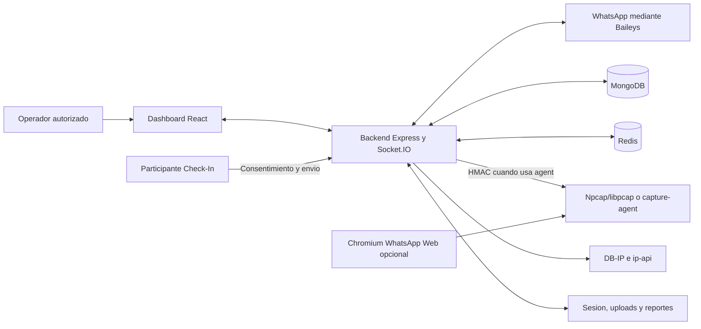
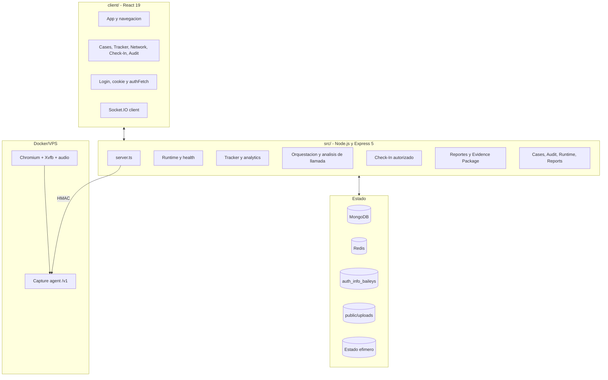
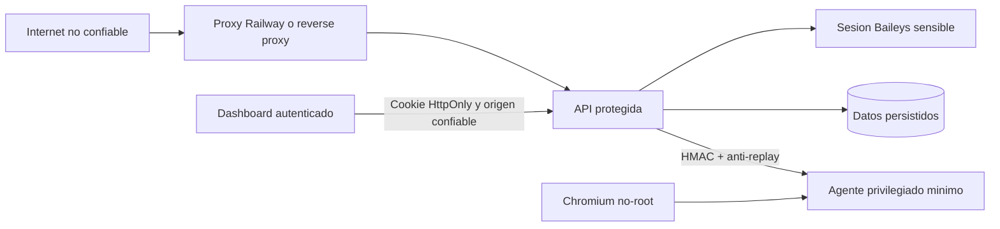

# Arquitectura

Documento canonico de arquitectura de WP MONITOR `3.1.0` candidato, inspirado en los puntos de vista de ISO/IEC/IEEE 42010. Describe el sistema implementado y probado localmente; la promocion estable exige el smoke E4 del VPS.

## Proposito y alcance

WP MONITOR es una aplicacion TypeScript para organizar casos autorizados, observaciones de actividad de WhatsApp, metadata de red local, Check-Ins consentidos, auditoria e informes. No es un proveedor oficial de WhatsApp ni una fuente de ubicacion fisica exacta.

## Vistas disponibles

| Vista | Pregunta que responde |
| --- | --- |
| [Contexto](../diagrams/01-system-context.md) | Quienes usan el sistema y que dependencias existen? |
| [Contenedores](../diagrams/02-container-view.md) | Que unidades ejecutan cada responsabilidad? |
| [Despliegue](../diagrams/03-deployment-topologies.md) | Donde corre cada capacidad? |
| [Componentes](component-catalog.md) | Que archivo/modulo es propietario de cada funcion? |
| [Flujos](runtime-flows.md) | Como se procesa una accion end-to-end? |
| [Datos](data-and-events.md) | Que se persiste, expira y relaciona? |
| [Calidad](quality-attributes.md) | Como se verifica comportamiento no funcional? |
| [Confianza](../diagrams/13-trust-boundaries.md) | Donde se validan entradas y protegen secretos? |

## Interesados

| Interesado | Preocupacion principal |
| --- | --- |
| Operador | Flujo claro, estados actuales y acciones auditables |
| Administrador | Configuracion, disponibilidad, volumenes y recuperacion |
| Auditor | Procedencia, marcas de tiempo, hashes y limitaciones |
| Participante de Check-In | Consentimiento, transparencia y minimizacion |
| Desarrollador | Contratos, modulos, pruebas y mantenibilidad |
| Responsable de seguridad | Secretos, acceso, retencion y exposicion de red |

## Vista de contexto

La version independiente, con alcance y lectura, esta en [Diagrama 01](../diagrams/01-system-context.md).

## Contenedores logicos

La vista ampliada esta en [Diagrama 02](../diagrams/02-container-view.md).

## Responsabilidades del backend

| Modulo | Responsabilidad |
| --- | --- |
| `src/server.ts` | Bootstrap, middleware, Baileys, REST, Socket.IO y composicion |
| `src/runtime.ts` | Modo de despliegue, capacidades, proxy y seguridad de produccion |
| `src/db.ts` | Colecciones, indices, TTL y operaciones persistentes |
| `src/tracker.ts` | Probes RTT y clasificacion de actividad |
| `src/analytics.ts` | Estadisticas, sesiones y patrones historicos |
| `src/packet-capture.ts` | Interfaces, captura local, filtros y estadisticas |
| `src/call-analyzer.ts` | Ventana de llamada y resultado tecnico |
| `src/call-capture-service.ts` | Seleccion del proveedor `disabled/local/agent` |
| `src/capture-agent-*` | Contrato HMAC, sidecar y validacion entre servicios |
| `src/call-scoring.ts` | Clasificacion y score de IP candidata |
| `src/ip-enrichment.ts` | DB-IP principal y complemento de metadata |
| `src/check-in.ts` | Modelo, landing, consentimiento y recibo de Check-In |
| `src/evidence-package.ts` | Manifiesto, hashes y ZIP de evidencia |
| `src/routes/*` | Contratos HTTP por dominio |

## Responsabilidades del frontend

| Vista | Responsabilidad |
| --- | --- |
| `Cases` | Crear, actualizar, seleccionar y cerrar casos |
| `Dashboard` | Contactos, actividad, estadisticas, perfil e informes |
| `NetworkMonitor` | Captura general, filtros, paquetes, estadisticas e IP Tracker |
| `CheckIns` | Crear, personalizar, revocar y revisar solicitudes |
| `AuditTrail` | Consultar eventos, filtrar y exportar evidencia por caso |

## Comunicacion

- REST obtiene estado durable, historial, informes y operaciones CRUD.
- Socket.IO entrega QR, conexion, actividad, presencia, llamadas, paquetes y cambios de Check-In.
- MongoDB es la fuente durable de casos y observaciones.
- El estado efimero conserva conexiones, temporizadores, presencia actual y captura activa.
- Baileys mantiene una sesion local y entrega eventos disponibles para la cuenta vinculada.
- En Docker/VPS, Chromium mantiene una segunda sesion WhatsApp Web persistente; el capture-agent observa solo ese namespace y devuelve metadata validada al backend.

## Limites de confianza

Consulta tambien [Diagrama 13](../diagrams/13-trust-boundaries.md).

La cuenta unica vive en MongoDB y sus sesiones opacas con TTL viven en Redis. REST y Socket.IO exigen la cookie de sesion; las mutaciones y el socket tambien validan el origen. La landing publica de Check-In utiliza un token de solicitud distinto y controles de tasa compartidos en Redis. La sesion Baileys, MongoDB, Redis, credenciales y privilegios de captura son activos de mayor sensibilidad.

## Modos de despliegue

Consulta [Deployment modes](../operations/deployment-modes.md). La regla central es:

- `local-full` nativo: dashboard, tracker y captura local en la maquina autorizada;
- Docker/VPS: `LOCAL_CAPTURE_ENABLED=false` y `CALL_CAPTURE_MODE=agent`, con navegador/agente aislados;
- `railway-dashboard`: dashboard, API y persistencia, sin captura de la interfaz del operador.

## Calidad arquitectonica y deuda conocida

- `server.ts` conserva una responsabilidad de composicion amplia; los dominios nuevos deben preferir rutas y servicios separados.
- Baileys es una integracion no oficial y puede cambiar por comportamiento upstream.
- Redis comparte sesiones, limites de login y rate limit publico entre replicas; la coordinacion de trackers y capturas sigue siendo de instancia unica.
- Una instancia controla como maximo una captura general y una captura de llamada; el agente rechaza una segunda ventana concurrente.
- La sesion y los uploads necesitan volumenes separados en infraestructura efimera.
- Chromium requiere un perfil persistente exclusivo, Selkies tras un acceso/tunel protegido, bindings de contingencia solo en loopback y una excepcion seccomp acotada para su sandbox de namespaces.

## Lecturas relacionadas

- [Catalogo de componentes](component-catalog.md)
- [Flujos de ejecucion](runtime-flows.md)
- [Atributos de calidad](quality-attributes.md)
- [Biblioteca de diagramas](../diagrams/README.md)
- [Datos y eventos](data-and-events.md)
- [Decisiones arquitectonicas](../adr/README.md)
- [Seguridad](../security/README.md)
- [API](../development/api-reference.md)
