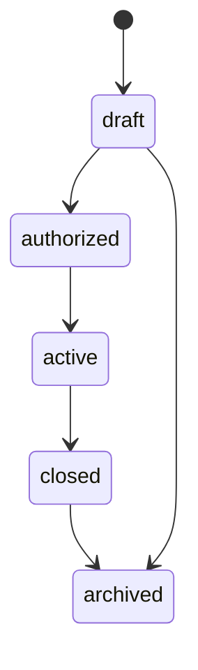
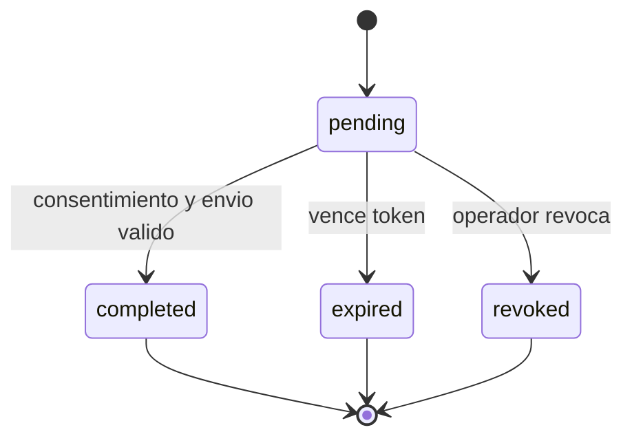
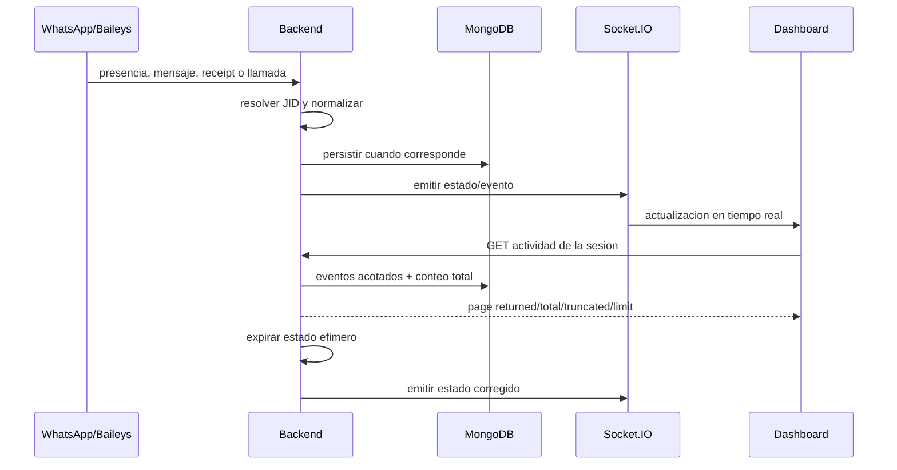
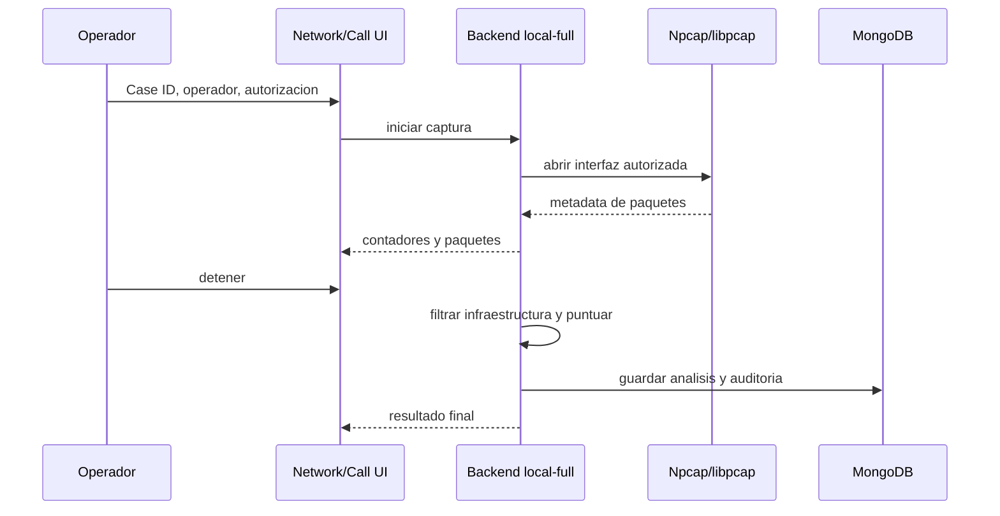

# Datos y Eventos

Vistas independientes: [modelo MongoDB](../diagrams/11-mongodb-data-model.md), [maquinas de estado](../diagrams/12-state-machines.md) y [pipeline de actividad](../diagrams/06-activity-pipeline.md).

## Persistencia MongoDB

| Entidad | Indice principal | Retencion implementada |
| --- | --- | --- |
| Operador unico | `normalizedUsername` unico, ID fijo `primary-operator` | Sin TTL automatico |
| Mediciones RTT | `caseId + jid + timestamp`, `trackingSessionId + timestamp` | TTL 30 dias |
| Eventos de actividad | `caseId + jid + timestamp`, `trackingSessionId + timestamp` | TTL 90 dias |
| Contactos | `jid` unico | Sin TTL automatico |
| Sesiones de tracking | `trackingSessionId` unico, un `jid` activo | Sin TTL automatico |
| Ventanas de cobertura de presencia | `trackingSessionId + startedAt`, una ventana abierta por sesion | Sin TTL automatico |
| Analisis de llamada | `caseId + callId` unico, `targetJid + startTime` | TTL 90 dias |
| Eventos de auditoria | `caseId + timestamp`, `scope + action` | Sin TTL automatico |
| Casos | `caseId` unico, `status + updatedAt` | Sin TTL automatico |
| Enlaces de evidencia | `caseId + type + refId` unico | Sin TTL automatico |
| Check-Ins | `token` unico, `caseId + createdAt` | Estado/expiracion controlados por aplicacion |

Los TTL son comportamiento del codigo vigente y no sustituyen una politica institucional de retencion. La organizacion debe definir conservacion, borrado, respaldo y excepciones legales.

MongoDB conserva solo el hash scrypt salado del operador y una `credentialVersion`. Redis conserva sesiones opacas con TTL; las claves usan una huella HMAC, no el token crudo. Cambiar credenciales incrementa la version y revoca las sesiones anteriores.

`contacts` conserva el perfil global conocido del JID. La autorizacion y el ciclo operativo viven en `tracking_sessions`: cada sesion pertenece a un solo caso, operador y nota de autorizacion. Las mediciones y eventos previos a este modelo no tienen esos campos y no se incorporan silenciosamente a un paquete de evidencia filtrado por caso.

Los analisis de llamada nuevos tambien conservan `caseId`; el paquete de evidencia exige coincidencia de caso y `callId`, evitando que un identificador manual reutilizado sobrescriba o incorpore el analisis de otro caso.

Una sesion pasa de `active` a `stopped`, `interrupted` o `failed`. Solo puede existir una sesion `active` por JID en una instancia de datos. Las reconexiones de WhatsApp y reinicios normales del proceso reanudan la misma sesion autorizada; detener desde el dashboard la cierra. Si al restaurar el caso ya no esta activo, la sesion queda `interrupted`.

`presence_coverage_windows` registra cuando el canal de presencia fue suscrito y
confirmado por el backend. Un heartbeat durable actualiza `lastConfirmedAt`; una
desconexion o cierre controlado fija `endedAt`. Tras una caida abrupta, la
siguiente restauracion cierra la ventana anterior en su ultima confirmacion, no
en la hora de reinicio. Por tanto, la cobertura cuantifica observabilidad del
canal y nunca tiempo online, uso de WhatsApp o actividad con terceros.

## Estados de caso

El backend acepta `draft`, `authorized`, `active`, `closed` y `archived`. Cerrar usa una operacion explicita y genera auditoria.

## Estados de Check-In

Eliminar una solicitud y revocarla son operaciones distintas. La eliminacion retira el registro operativo; la auditoria conserva que la accion ocurrio.

## Fuentes de actividad

| Fuente | Naturaleza | Persistencia/uso |
| --- | --- | --- |
| RTT probe | Medicion heuristica | Serie historica y clasificacion |
| Disponibilidad Baileys (`available`/`unavailable`) | Evento efimero visible | Disponibilidad observada en un instante; no identifica conversacion ni actividad con terceros |
| Senal directa de chat (`composing`/`recording`/`paused`) | Evento efimero de la conversacion vinculada | Estado actual y transicion directa cuando aplica |
| Mensaje | Evento real de sesion vinculada, sin contenido | Senal de actividad de la sesion activa |
| Receipt | Estado compatible de mensaje real saliente | Transicion monotona con huella opaca del ID; no RTT experimental |
| Llamada | Ciclo `offer/ringing/accept/reject/timeout/terminate` | Estado en vivo y actividad vinculada |
| Captura de red | Metadata local | Paquetes en memoria, exports y resumen vinculado |
| Check-In | Solicitud consentida | Registro, recibo y hash |

No combines estas fuentes sin conservar `source`, alcance, tiempo y confianza. Ausencia de un evento no demuestra ausencia de actividad, y disponibilidad visible no demuestra con quien interactua el contacto.

## Flujo de actividad al dashboard

## Flujo de captura y analisis

## Procedencia y tiempo

- El backend almacena marcas de tiempo en UTC.
- La interfaz puede presentar hora local, pero los informes deben conservar UTC.
- Las observaciones de tracking deben incluir `caseId` y `trackingSessionId`; el operador y la autorizacion pertenecen a la sesion durable.
- Los detalles persistidos de mensajes/receipts pueden incluir `messageIdHash`, pero no el ID crudo ni contenido del mensaje.
- El reporte de contacto conserva `caseId`, `trackingSessionId`, la lista pasiva atribuible y la duracion calculada con señales pasivas aunque no exista RTT.
- La API de actividad y los reportes declaran `returned`, `total`, `truncated` y `limit`; el total no se infiere del tamano de una pagina acotada.
- El Evidence Package 1.2 incorpora `observedActivity` y metadata de cobertura para auditoria, enlaces y analisis de llamada; el ZIP materializa `observed-activity.json` y `annexes/observed-activity.csv`, ambos cubiertos por hashes de integridad.
- Un hash se calcula sobre una representacion canonica o archivo concreto; cualquier regeneracion produce un nuevo hash.
- La procedencia debe viajar con el dato, no depender de memoria del operador.
