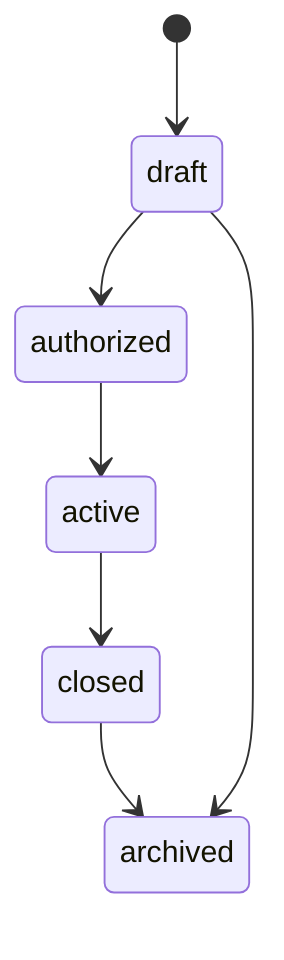
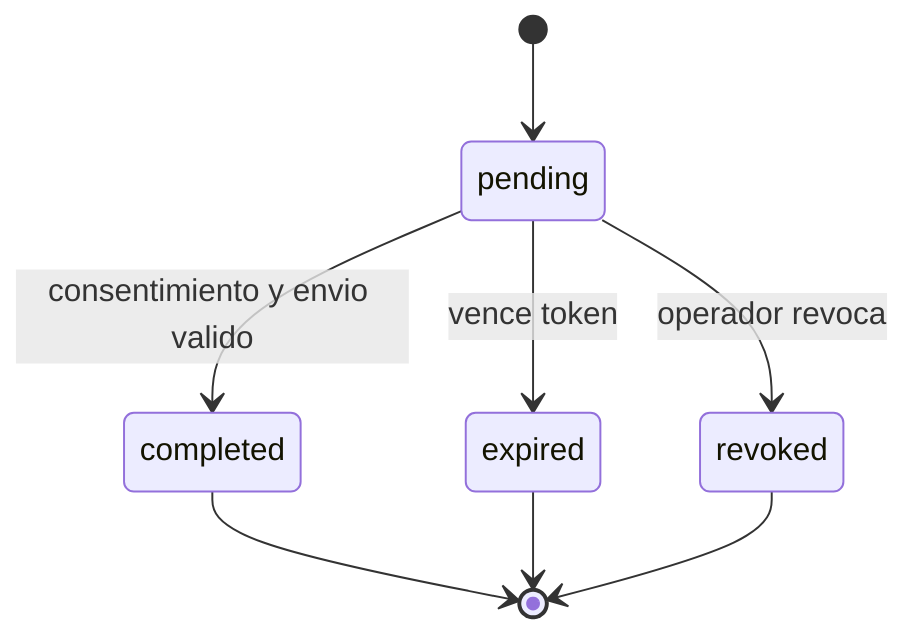
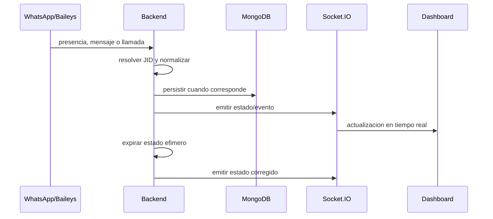
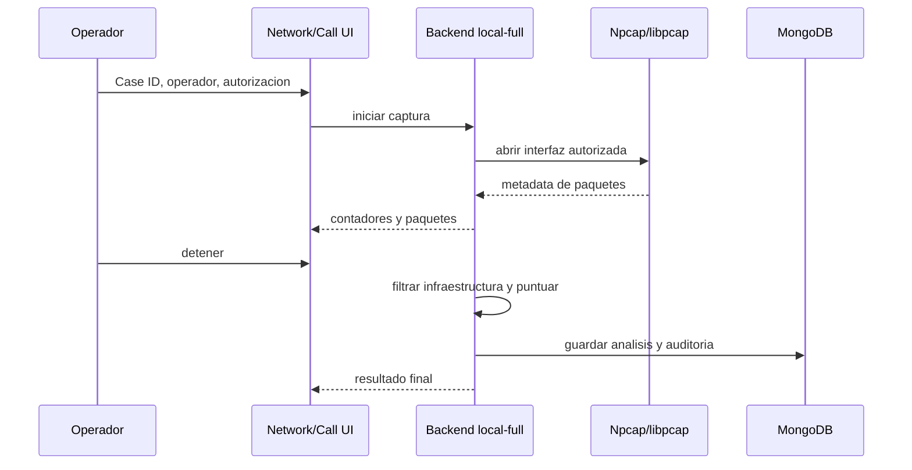

# Datos y Eventos

Vistas independientes: [modelo MongoDB](../diagrams/11-mongodb-data-model.md), [maquinas de estado](../diagrams/12-state-machines.md) y [pipeline de actividad](../diagrams/06-activity-pipeline.md).

## Persistencia MongoDB

| Entidad | Indice principal | Retencion implementada |
| --- | --- | --- |
| Mediciones RTT | `jid + timestamp` | TTL 30 dias |
| Eventos de actividad | `jid + timestamp`, `source + type` | TTL 90 dias |
| Contactos | `jid` unico | Sin TTL automatico |
| Analisis de llamada | `callId`, `targetJid + startTime` | TTL 90 dias |
| Eventos de auditoria | `caseId + timestamp`, `scope + action` | Sin TTL automatico |
| Casos | `caseId` unico, `status + updatedAt` | Sin TTL automatico |
| Enlaces de evidencia | `caseId + type + refId` unico | Sin TTL automatico |
| Check-Ins | `token` unico, `caseId + createdAt` | Estado/expiracion controlados por aplicacion |

Los TTL son comportamiento del codigo vigente y no sustituyen una politica institucional de retencion. La organizacion debe definir conservacion, borrado, respaldo y excepciones legales.

## Estados de caso

El backend acepta `draft`, `authorized`, `active`, `closed` y `archived`. Cerrar usa una operacion explicita y genera auditoria.

## Estados de Check-In

Eliminar una solicitud y revocarla son operaciones distintas. La eliminacion retira el registro operativo; la auditoria conserva que la accion ocurrio.

## Fuentes de actividad

| Fuente | Naturaleza | Persistencia/uso |
| --- | --- | --- |
| RTT probe | Medicion heuristica | Serie historica y clasificacion |
| Presencia Baileys | Evento efimero | Estado actual y transicion cuando aplica |
| Mensaje | Evento de sesion vinculada | Senal de actividad disponible |
| Llamada | Ciclo `offer/ringing/accept/reject/timeout/terminate` | Estado en vivo y actividad vinculada |
| Captura de red | Metadata local | Paquetes en memoria, exports y resumen vinculado |
| Check-In | Solicitud consentida | Registro, recibo y hash |

No combines estas fuentes sin conservar `source`, tiempo y confianza. Ausencia de un evento no demuestra ausencia de actividad.

## Flujo de actividad al dashboard

## Flujo de captura y analisis

## Procedencia y tiempo

- El backend almacena marcas de tiempo en UTC.
- La interfaz puede presentar hora local, pero los informes deben conservar UTC.
- Los eventos deben incluir caso y operador cuando la operacion lo exige.
- Un hash se calcula sobre una representacion canonica o archivo concreto; cualquier regeneracion produce un nuevo hash.
- La procedencia debe viajar con el dato, no depender de memoria del operador.
