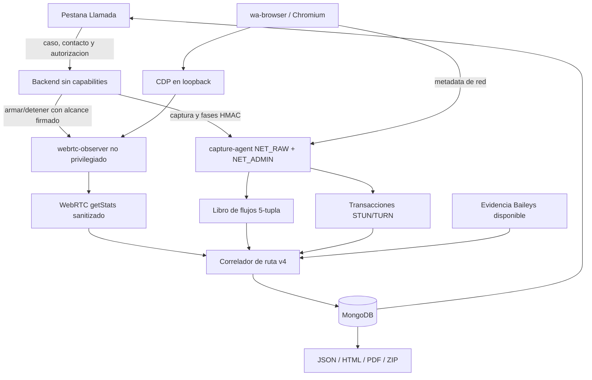

# Plan Incremental OBS-29: Observabilidad WebRTC y Correlacion de Ruta v4

Estado: `PLANNED (E1 DESIGN)`

Fecha de decision: `2026-09-11`

Rama objetivo: `develop`

Este documento controla trabajo futuro. No declara que CDP, `getStats()`, el
sidecar propuesto o el correlador v4 esten implementados ni disponibles en el
VPS.

## Resultado que se busca

Aumentar la capacidad de distinguir una ruta directa de una ruta por relay en
una llamada autorizada originada o recibida por `wa-browser`. El motor actual de
libpcap, fases, scoring v3, Baileys, persistencia e informes permanece como base
operativa y como fallback.

No se busca:

- obtener una IP a partir de un numero telefonico;
- descubrir actividad del contacto con terceros;
- convertir GeoIP en GPS, antena, router o domicilio;
- inspeccionar contenido, audio, SDP completo o credenciales;
- afirmar una ruta directa cuando Chromium o WhatsApp no exponen el candidato;
- crear otra pestana o separar comercialmente dos motores.

## Linea base demostrada

`OBS-20.12I` alcanzo E4 con una llamada autorizada, 3.596 paquetes reconciliados,
cero descartados y resultado `relay_confirmed`. El libro conservo siete
endpoints Meta/relay y tres Google/cloud, sin candidata directa elegible. La
captura, persistencia y exportaciones funcionaron; el vacio pendiente es una
fuente automatica del navegador que permita relacionar el flujo seleccionado
con la metadata de paquetes.

## Arquitectura propuesta

### Limites de confianza

- El puerto CDP se enlaza solo a `127.0.0.1` y nunca se publica al host, al
  tunel ni a redes externas.
- `webrtc-observer` comparte el namespace de red del navegador, pero funciona
  sin capabilities, como usuario no root y con filesystem de solo lectura.
- El observer expone un contrato acotado; nunca actua como proxy CDP generico.
- El backend arma observer y captura con el mismo alcance opaco de caso,
  contacto y llamada, TTL, idempotencia y secretos internos independientes.
- La captura de estadisticas solo existe durante una operacion autorizada. No se
  conserva SDP, contenido, ICE username fragments, URLs completas ni payloads.
- Un fallo del observer degrada el resultado al motor actual y registra una
  limitacion; no cancela ni pierde la captura libpcap.

## Contratos aditivos previstos

Los nombres definitivos se fijaran despues de la PoC. El diseno reserva:

- `browserWebRtcEvidence.version=1`: pares seleccionados/nominados, tipo de
  candidato, familia, protocolo, direccion y puerto solo cuando el navegador
  los exponga, contadores, RTT, tiempos y limitaciones.
- `flowEvidence.version=1`: cinco tuplas normalizadas, direccion, tiempos y
  conteos por fase, con limites explicitos.
- `stunTurnEvidence.version=1`: metodo/clase, huella de transaccion, roles de
  endpoint, `USE-CANDIDATE` y correlacion de ChannelData sin payload.
- `routeAssessment.version=4`: conclusion multifuente y razones reconstruibles;
  las versiones v2/v3 continuan legibles sin migracion destructiva.

## Tablero de nueve tareas

### OBS-29.1 — PoC WebRTC/CDP aislada — `TODO (E0)`

- Confirmar la version real de Chromium y obtener su protocolo CDP runtime.
- Probar inyeccion temprana y descubrimiento de `RTCPeerConnection` en una pagina
  WebRTC sintetica con perfil efimero.
- Verificar si una llamada autorizada de WhatsApp Web expone pares y candidatos
  utilizables; una direccion ausente tambien es un resultado valido.
- Cierre: evidencia E3 de viabilidad o descarte documentado, sin modificar el
  perfil ni los volumenes productivos.

### OBS-29.2 — Sidecar y contrato seguro — `TODO`

- Crear `webrtc-observer`, health/capabilities y ciclo start/status/stop firmado.
- Aplicar nonce anti-replay, TTL, limites, exclusividad e idempotencia.
- Cierre: ningun puerto publico; UID no root, capabilities vacias, rootfs de solo
  lectura y rechazo de peticiones invalidas.

### OBS-29.3 — Coleccion WebRTC y fases — `TODO`

- Registrar referencias a peer connections y consultar `getStats()` solo dentro
  del alcance autorizado.
- Emitir estados ICE/WebRTC sanitizados como evidencia de protocolo adicional.
- No convertir `ICE connected` en confirmacion humana de llamada contestada.
- Cierre: limites monotonos, memoria acotada y ausencia de SDP/contenido.

### OBS-29.4 — Libro de flujos de cinco tuplas — `TODO`

- Conservar familia, protocolo, IP/puerto remoto, puerto local, primera/ultima
  observacion, direccion, bytes y paquetes por fase.
- Mantener el agregado historico por IP para compatibilidad.
- Cierre: reconciliacion exacta, deduplicacion y truncamiento declarado.

### OBS-29.5 — Correlacion STUN/TURN — `TODO`

- Relacionar request/response por huella, direccion y ventana temporal.
- Exponer roles y flags permitidos; reconocer ChannelData sin inspeccionar
  payload y solo relacionarlo con un `CHANNEL-BIND` observado.
- Cierre: fixtures IPv4/IPv6, paquetes truncados, orden invertido y limites de
  memoria pasan pruebas negativas y positivas.

### OBS-29.6 — Correlador de ruta v4 — `TODO`

- Combinar WebRTC, cinco tuplas, STUN/TURN, fases, Baileys y registro de
  infraestructura con precedencia y contradicciones explicitas.
- Exigir coincidencia exacta entre candidato remoto elegible y flujo activo para
  elevar confianza; relay, salida propia, DNS y GeoIP no se promueven.
- Cierre: resultados directo, relay, mixto, no expuesto y no resuelto son
  deterministas y compatibles con historicos v2/v3.

### OBS-29.7 — Persistencia, interfaz e informes — `TODO`

- Persistir contratos opcionales y acotados sin backfill obligatorio.
- Extender la pestana `Llamada`, no crear otra vista principal.
- Mantener paridad JSON, HTML, PDF, ZIP, CSV y Evidence Package.
- Cierre: historicos sin OBS-29 siguen legibles y las limitaciones son visibles.

### OBS-29.8 — Matriz QA, staging y rollback — `TODO`

- Cubrir ruta directa sintetica, relay, candidato oculto, observer caido,
  reconexion, duplicados, IPv4/IPv6, TURN y compatibilidad historica.
- Ejecutar typecheck, lint, builds, pruebas backend/frontend, docs, Compose,
  contenedores, licencias y audits.
- Cierre: feature flag desactivada restaura el comportamiento E4 actual sin
  tocar datos; staging no monta sesion ni volumenes productivos.

### OBS-29.9 — Despliegue VPS y E4 autorizada — `TODO`

- Validar Preview Compose, red, puertos, privilegios, secretos por nombre,
  persistencia, backup y rollback antes de desplegar.
- Activar inicialmente en `develop` y ejecutar una unica llamada autorizada.
- Cierre: salud, captura, observer, correlacion, persistencia, informes y
  degradacion pasan E4; solo entonces se evalua promocion.

## Archivos previstos

- Contenedores: `Dockerfile.browser`, nuevo `Dockerfile.webrtc-observer`,
  `docker-compose.yml`, override Dokploy y entrypoints.
- Backend: nuevo cliente/contrato del observer, orquestacion de captura,
  `call-analyzer`, `stun-parser`, correlador, persistencia y reportes.
- Frontend: tipos y `CallAnalysisPanel` dentro de la pestana existente.
- Operacion: `.env.example`, validacion de entorno, contratos Compose, runbook de
  Ubuntu/Dokploy y rollback.

No se agregara una dependencia de produccion hasta que `OBS-29.1` demuestre que
es necesaria, compatible, mantenida y licenciable.

## Secuencia y estimacion

La puerta entre `OBS-29.1` y `OBS-29.2` es obligatoria. Si la PoC no puede
observar WebRTC de forma estable, se detiene la rama CDP y se conservan como
mejoras independientes el libro de flujos y la correlacion STUN/TURN.

Estimacion orientativa, no compromiso de release:

- PoC y decision: 1-2 dias enfocados.
- Sidecar, flujos, STUN/TURN y correlador: 5-8 dias.
- UI, informes, QA, staging y E4: 3-5 dias mas coordinacion operacional.

## Evidencia y promocion

Cada tarea debe cerrar prueba positiva/negativa, compatibilidad, limites,
seguridad, rollback y nivel E0-E4. Un build verde no prueba que WhatsApp exponga
una IP remota. No se actualizan version, changelog ni comunicacion comercial
hasta que el comportamiento implementado alcance la evidencia requerida.
