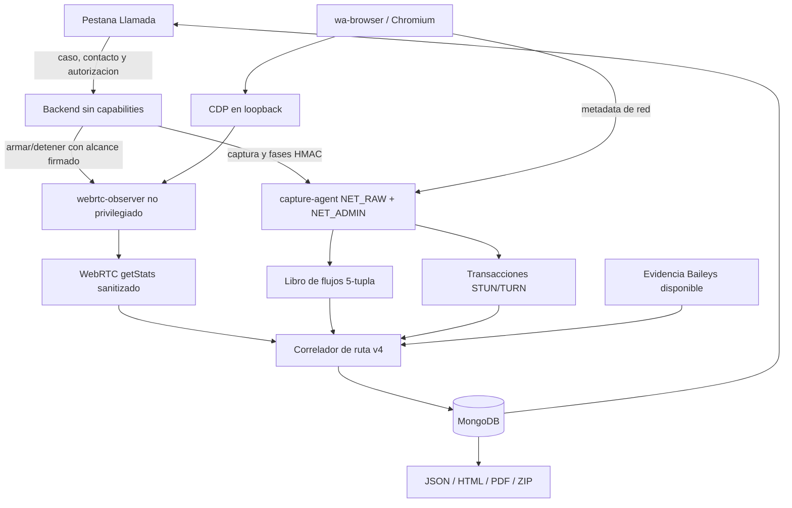

# Plan Incremental OBS-29: Observabilidad WebRTC y Correlacion de Ruta v4

Estado: `IMPLEMENTED LOCAL — QA/SMOKE AISLADO PASS; E4 VPS PENDIENTE`

Fecha de decision: `2026-09-11`

Rama objetivo: `develop`

Este documento controla la implementacion y su promocion. CDP, `getStats()`, el
sidecar y el correlador v4 ya existen en la rama de trabajo y poseen evidencia
local E2/E3; todavia no se declaran disponibles ni operativos en el VPS.

## Resultado que se busca

Aumentar la capacidad de distinguir una ruta directa de una ruta por relay en
una llamada autorizada originada o recibida por `wa-browser`. El motor actual de
libpcap, fases, scoring v3, Baileys, persistencia e informes permanece como base
operativa y como fallback.

No se busca:

- obtener una IP a partir de un numero telefonico;
- descubrir actividad del contacto con terceros;
- convertir GeoIP en GPS, antena, router o domicilio;
- inspeccionar contenido, audio, SDP completo o credenciales;
- afirmar una ruta directa cuando Chromium o WhatsApp no exponen el candidato;
- crear otra pestana o separar comercialmente dos motores.

## Linea base demostrada

`OBS-20.12I` alcanzo E4 con una llamada autorizada, 3.596 paquetes reconciliados,
cero descartados y resultado `relay_confirmed`. El libro conservo siete
endpoints Meta/relay y tres Google/cloud, sin candidata directa elegible. La
captura, persistencia y exportaciones funcionaron; el vacio pendiente es una
fuente automatica del navegador que permita relacionar el flujo seleccionado
con la metadata de paquetes.

## Arquitectura propuesta

### Limites de confianza

- El puerto CDP se enlaza solo a `127.0.0.1` y nunca se publica al host, al
  tunel ni a redes externas.
- `webrtc-observer` comparte el namespace de red del navegador, pero funciona
  sin capabilities, como usuario no root y con filesystem de solo lectura.
- El observer expone un contrato acotado; nunca actua como proxy CDP generico.
- El backend arma observer y captura con el mismo alcance opaco de caso,
  contacto y llamada, TTL, idempotencia y secretos internos independientes.
- La captura de estadisticas solo existe durante una operacion autorizada. No se
  conserva SDP, contenido, ICE username fragments, URLs completas ni payloads.
- Un fallo del observer degrada el resultado al motor actual y registra una
  limitacion; no cancela ni pierde la captura libpcap.

## Contratos aditivos implementados

- `browserWebRtcEvidence.version=1`: pares seleccionados/nominados, tipo de
  candidato, familia, protocolo, direccion y puerto solo cuando el navegador
  los exponga, contadores, RTT, tiempos y limitaciones.
- `flowEvidence.version=1`: cinco tuplas normalizadas, direccion, tiempos y
  conteos por fase, con limites explicitos.
- `stunTurnEvidence.version=1`: metodo/clase, huella de transaccion, roles de
  endpoint, `USE-CANDIDATE` y correlacion de ChannelData sin payload.
- `routeAssessment.version=4`: conclusion multifuente y razones reconstruibles;
  las versiones v2/v3 continuan legibles sin migracion destructiva.

## Tablero de nueve tareas

### OBS-29.1 — PoC WebRTC/CDP aislada — `PARCIAL (E3 LOCAL SYNTHETIC)`

- Confirmar la version real de Chromium y obtener su protocolo CDP runtime.
- Probar inyeccion temprana y descubrimiento de `RTCPeerConnection` en una pagina
  WebRTC sintetica con perfil efimero.
- Verificar si una llamada autorizada de WhatsApp Web expone pares y candidatos
  utilizables; una direccion ausente tambien es un resultado valido.
- Cierre: evidencia E3 de viabilidad o descarte documentado, sin modificar el
  perfil ni los volumenes productivos.
- Evidencia del 2026-09-11: `pnpm run poc:webrtc-cdp` inicio Chrome 153 con
  perfil efimero y CDP 1.3 en loopback, inyecto el observer antes de navegar y
  construyo dos `RTCPeerConnection` sinteticos. `getStats()` devolvio dos pares
  `host/UDP` seleccionados, nominados y exitosos, con puertos, paquetes, bytes y
  RTT observables. Las direcciones local/remota no fueron expuestas en esta
  ejecucion, condicion conservada como evidencia ausente y no reparada mediante
  SDP. Tres contratos automatizados validan limites y eliminacion de IPs, SDP,
  URLs y campos no permitidos. El camino de exito y el timeout retiraron el
  proceso y perfil temporal sin residuos.
- Verificacion local actualizada el 2026-09-12: la PoC volvio a pasar fuera del
  sandbox con Chrome 153/CDP 1.3, dos conexiones y dos pares seleccionados. La
  limpieza ahora reconoce terminacion por señal, espera el cierre y reintenta
  exclusivamente el retiro de su perfil efimero; no quedaron residuos.
- Pendiente para cierre: ejecutar el mismo concepto de manera controlada sobre
  `wa-browser` y una unica llamada autorizada para comprobar si WhatsApp Web
  crea conexiones observables y si expone candidatos distintos a la fixture.
  Hasta entonces no se habilita CDP en el Compose ni se acepta el ADR 0006.

### OBS-29.2 — Sidecar y contrato seguro — `IMPLEMENTED (E2 LOCAL)`

- Crear `webrtc-observer`, health/capabilities y ciclo start/status/stop firmado.
- Aplicar nonce anti-replay, TTL, limites, exclusividad e idempotencia.
- Cierre: ningun puerto publico; UID no root, capabilities vacias, rootfs de solo
  lectura y rechazo de peticiones invalidas.
- Implementado: servicio `webrtc-observer`, health live/ready, control HMAC con
  nonce anti-replay, TTL, exclusividad e idempotencia. Desactivado permanece
  vivo sin secreto y rechaza todo control; activado exige secreto independiente,
  instala la sonda dormida mediante readiness y no publica puertos.

### OBS-29.3 — Coleccion WebRTC y fases — `IMPLEMENTED (E2 LOCAL)`

- Registrar referencias a peer connections y consultar `getStats()` solo dentro
  del alcance autorizado.
- Emitir estados ICE/WebRTC sanitizados como evidencia de protocolo adicional.
- No convertir `ICE connected` en confirmacion humana de llamada contestada.
- Cierre: limites monotonos, memoria acotada y ausencia de SDP/contenido.
- Implementado: wrapper temprano de `RTCPeerConnection`, armado por generacion
  para impedir contaminacion entre llamadas, `getStats()` tolerante a conexiones
  cerradas y contratos acotados. La captura automatica declara que el inicio
  puede ser parcial; `ICE connected` no reemplaza el marcador humano.
- Endurecimiento E2 del 2026-09-14: el backend reconcilia el alcance exacto del
  observer con el estado autoritativo de la captura durante arranque y salud
  periodica. Recupera un alcance coincidente despues de reiniciar, declara si el
  observer perdio su estado, desarma alcances huerfanos o divergentes por su
  `callId` exacto y serializa reconciliacion, inicio y cierre. No rearma una
  observacion parcial ni mezcla contactos de forma automatica.
- Endurecimiento E2 del 2026-09-14: al vencer el TTL, el observer obtiene un
  unico snapshot final, desarma inmediatamente la sonda y conserva el resultado
  por un maximo de una hora y 32 llamadas. El contrato `stop` puede recuperar
  ese resultado por el mismo `callId` de forma idempotente; otro `callId`, una
  entrada vencida o un observer reiniciado fallan cerrados. La reconciliacion
  del backend consume primero esta evidencia acotada antes de declarar perdida
  de alcance, sin rearmar ni prolongar la observacion.
- Cierre de carrera E2 del 2026-09-14: si el capture-agent completa primero, la
  reconciliacion conserva el snapshot activo o expirado del observer hasta que
  el backend recupere el resultado idempotente de paquetes. Un alcance distinto
  se desarma y produce una limitacion explicita; nunca se adjunta evidencia de
  otra llamada.

### OBS-29.4 — Libro de flujos de cinco tuplas — `IMPLEMENTED (E2 LOCAL)`

- Conservar familia, protocolo, IP/puerto remoto, puerto local, primera/ultima
  observacion, direccion, bytes y paquetes por fase.
- Mantener el agregado historico por IP para compatibilidad.
- Cierre: reconciliacion exacta, deduplicacion y truncamiento declarado.
- Implementado: libro v1 IPv4/IPv6 por protocolo, puerto local, IP/puerto remoto,
  direccion, tiempos, bytes, paquetes y fase. La lectura rechaza valores
  reescritos o inconsistentes y conserva el agregado historico por IP.

### OBS-29.5 — Correlacion STUN/TURN — `IMPLEMENTED (E2 LOCAL)`

- Relacionar request/response por huella, direccion y ventana temporal.
- Exponer roles y flags permitidos; reconocer ChannelData sin inspeccionar
  payload y solo relacionarlo con un `CHANNEL-BIND` observado.
- Cierre: fixtures IPv4/IPv6, paquetes truncados, orden invertido y limites de
  memoria pasan pruebas negativas y positivas.
- Implementado: huellas opacas request/response, clase/metodo, `USE-CANDIDATE`,
  rol ICE, `CHANNEL-NUMBER` y ChannelData sin payload. ChannelData solo se
  correlaciona tras un `CHANNEL-BIND`; una envoltura aislada queda como
  limitacion y nunca como prueba de ruta.
- Endurecimiento E2 del 2026-09-14: cada enlace de canal queda acotado a la
  asignacion TURN canonica (familia, protocolo, IP/puerto local e IP/puerto del
  servidor). La reutilizacion de un numero entre relays, transportes o peers no
  mezcla paquetes ni bytes; ChannelData sin enlace en esa asignacion y el
  limite de 64 canales y enlaces activos se declaran como limitaciones. El enlace observado
  expira a los 10 minutos, puede refrescarse solo mediante otro `CHANNEL-BIND` y
  ChannelData no renueva su vigencia. Fixtures UDP/TCP, IPv4/IPv6, direccion
  inversa, expiracion, reasignacion y memoria acotada pasan localmente.

### OBS-29.6 — Correlador de ruta v4 — `IMPLEMENTED (E2 LOCAL)`

- Combinar WebRTC, cinco tuplas, STUN/TURN, fases, Baileys y registro de
  infraestructura con precedencia y contradicciones explicitas.
- Exigir coincidencia exacta entre candidato remoto elegible y flujo activo para
  elevar confianza; relay, salida propia, DNS y GeoIP no se promueven.
- Cierre: resultados directo, relay, mixto, no expuesto y no resuelto son
  deterministas y compatibles con historicos v2/v3.
- Implementado: `direct_confirmed` por WebRTC exige par seleccionado/exitoso,
  ausencia de relay, candidata ya elegible y coincidencia exacta IP, puerto y
  protocolo con un flujo bidireccional de al menos 20 paquetes en negociacion o
  fase activa. GeoIP/E.164 aportan cero; libros parciales aplican topes.

### OBS-29.7 — Persistencia, interfaz e informes — `IMPLEMENTED (E2 LOCAL)`

- Persistir contratos opcionales y acotados sin backfill obligatorio.
- Extender la pestana `Llamada`, no crear otra vista principal.
- Mantener paridad JSON, HTML, PDF, ZIP, CSV y Evidence Package.
- Cierre: historicos sin OBS-29 siguen legibles y las limitaciones son visibles.
- Implementado: normalizacion fail-closed independiente, verificacion cruzada
  entre una conclusion v4 y sus libros, bloque comercial dentro de `Llamada` y
  procedencia equivalente en JSON, HTML, PDF, ZIP y CSV.

### OBS-29.8 — Matriz QA, staging y rollback — `LOCAL PASS; VPS PENDING`

- Cubrir ruta directa sintetica, relay, candidato oculto, observer caido,
  reconexion, duplicados, IPv4/IPv6, TURN y compatibilidad historica.
- Ejecutar typecheck, lint, builds, pruebas backend/frontend, docs, Compose,
  contenedores, licencias y audits.
- Cierre: feature flag desactivada restaura el comportamiento E4 actual sin
  tocar datos; staging no monta sesion ni volumenes productivos.
- Evidencia local del 2026-09-12: 408/408 pruebas backend y 42/42 frontend,
  typecheck, lint, builds de aplicacion, 71 Markdown/154 enlaces/36 Mermaid,
  fixture de cinco reportes, 218 licencias de produccion y ambas auditorias de
  dependencias pasaron. Compose paso con el observer apagado y encendido; las
  cinco imagenes se construyeron desde bases inmutables y las tres imagenes
  Node no contienen TypeScript ni `tsx` en runtime.
- Smoke E3 aislado: `wa-browser` y `webrtc-observer` quedaron saludables, el
  observer obtuvo liveness/readiness por CDP loopback, compartio exclusivamente
  el namespace del navegador, corrio no root/sin capabilities/rootfs de solo
  lectura y no publico puertos. Un ciclo HMAC start/status/stop quedo activo,
  devolvio evidencia `available` sin conexiones inventadas, repitio stop de
  forma idempotente y termino inactivo; el observer cerro con codigo cero. Uso
  un perfil sintetico nuevo; los contenedores y ese volumen se retiraron al
  finalizar sin tocar perfiles productivos.
- Pendiente: repetir las puertas sobre el commit exacto en el VPS, verificar
  backup/rollback y ejecutar la unica llamada E4 autorizada de `OBS-29.9`.
- Cierre local de endurecimiento del 2026-09-14: 436/436 pruebas backend y
  42/42 frontend, typecheck, lint, builds y cinco fixtures de informe pasaron.
  Las regresiones nuevas cubren asignaciones TURN aisladas, memoria acotada,
  reinicios, vencimiento TTL, cierre concurrente, finalizacion del agente antes
  del observer, idempotencia y rechazo de alcances ajenos. Documentacion,
  Compose sintetico, contenedores inmutables, 218 licencias y ambos audits de
  dependencias permanecen en PASS. Esto es E2 local; no reemplaza `OBS-29.9`.

### OBS-29.9 — Despliegue VPS y E4 autorizada — `TODO`

- El intento RELEASE del SHA `7a5b60e` completo E1, E2, Preview Compose y
  backup, pero se detuvo antes de modificar el runtime: GHCR habia retirado el
  manifiesto Selkies fijado bajo la etiqueta movil `main-debiantrixie`.
- `INC-SELKIES-01` reemplaza esa dependencia por la release versionada
  `v2.0.0rc0-debiantrixie` fijada a su indice OCI y hace que
  `containers:check` rechace `main` y `latest` incluso con digest. El build
  limpio y el smoke aislado no-root/read-only pasaron, incluidos noVNC,
  autenticacion Selkies, Chromium y CDP solo interno. Falta generar el nuevo
  SHA autorizado y repetir la promocion en VPS; el runtime anterior no fue
  modificado.
- Validar Preview Compose, red, puertos, privilegios, secretos por nombre,
  persistencia, backup y rollback antes de desplegar.
- Activar inicialmente en `develop` y ejecutar una unica llamada autorizada.
- Cierre: salud, captura, observer, correlacion, persistencia, informes y
  degradacion pasan E4; solo entonces se evalua promocion.

## Archivos previstos

- Contenedores: `Dockerfile.browser`, nuevo `Dockerfile.webrtc-observer`,
  `docker-compose.yml`, override Dokploy y entrypoints.
- Backend: nuevo cliente/contrato del observer, orquestacion de captura,
  `call-analyzer`, `stun-parser`, correlador, persistencia y reportes.
- Frontend: tipos y `CallAnalysisPanel` dentro de la pestana existente.
- Operacion: `.env.example`, validacion de entorno, contratos Compose, runbook de
  Ubuntu/Dokploy y rollback.

No se agregara una dependencia de produccion hasta que `OBS-29.1` demuestre que
es necesaria, compatible, mantenida y licenciable.

## Secuencia y estimacion

La puerta entre `OBS-29.1` y `OBS-29.2` es obligatoria. Si la PoC no puede
observar WebRTC de forma estable, se detiene la rama CDP y se conservan como
mejoras independientes el libro de flujos y la correlacion STUN/TURN.

Estimacion orientativa, no compromiso de release:

- PoC y decision: 1-2 dias enfocados.
- Sidecar, flujos, STUN/TURN y correlador: 5-8 dias.
- UI, informes, QA, staging y E4: 3-5 dias mas coordinacion operacional.

## Evidencia y promocion

Cada tarea debe cerrar prueba positiva/negativa, compatibilidad, limites,
seguridad, rollback y nivel E0-E4. Un build verde no prueba que WhatsApp exponga
una IP remota. No se actualizan version, changelog ni comunicacion comercial
hasta que el comportamiento implementado alcance la evidencia requerida.
