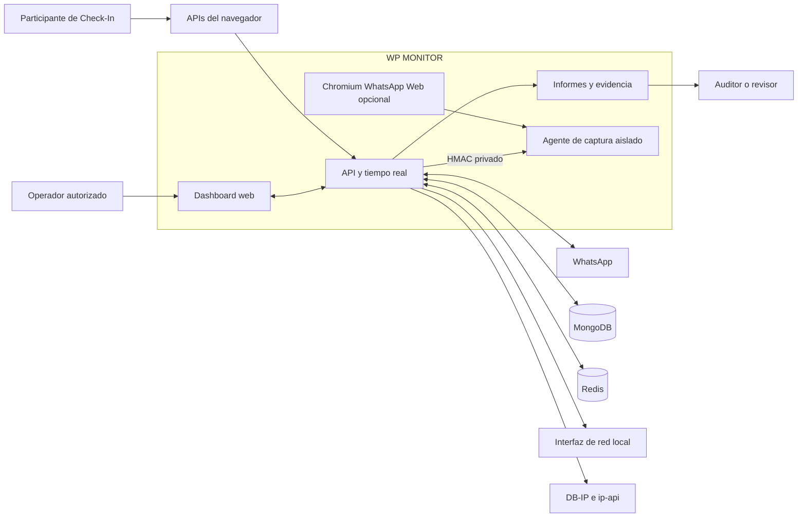

# Diagrama 01: Contexto del Sistema

## Proposito

Mostrar quienes interactuan con WP MONITOR, que sistemas externos participan y donde termina la responsabilidad de la aplicacion. Esta vista no describe archivos ni procesos internos.

## Lectura

- El operador controla el dashboard. La captura general ocurre en el backend local autorizado; la captura de llamada Docker/VPS ocurre en el agente que comparte namespace con Chromium.
- WhatsApp y los proveedores GeoIP son dependencias externas; WP MONITOR no controla su disponibilidad ni exactitud.
- MongoDB conserva identidad y evidencia durable; Redis conserva sesiones opacas y contadores compartidos con TTL.
- El participante entrega datos de Check-In mediante APIs del navegador y consentimiento.
- El auditor recibe artefactos derivados; los hashes permiten verificar integridad desde su generacion.

## Limite importante

El diagrama no implica que el backend cloud pueda acceder a la interfaz de red del operador. Esa separacion aparece en [Despliegue](03-deployment-topologies.md).
