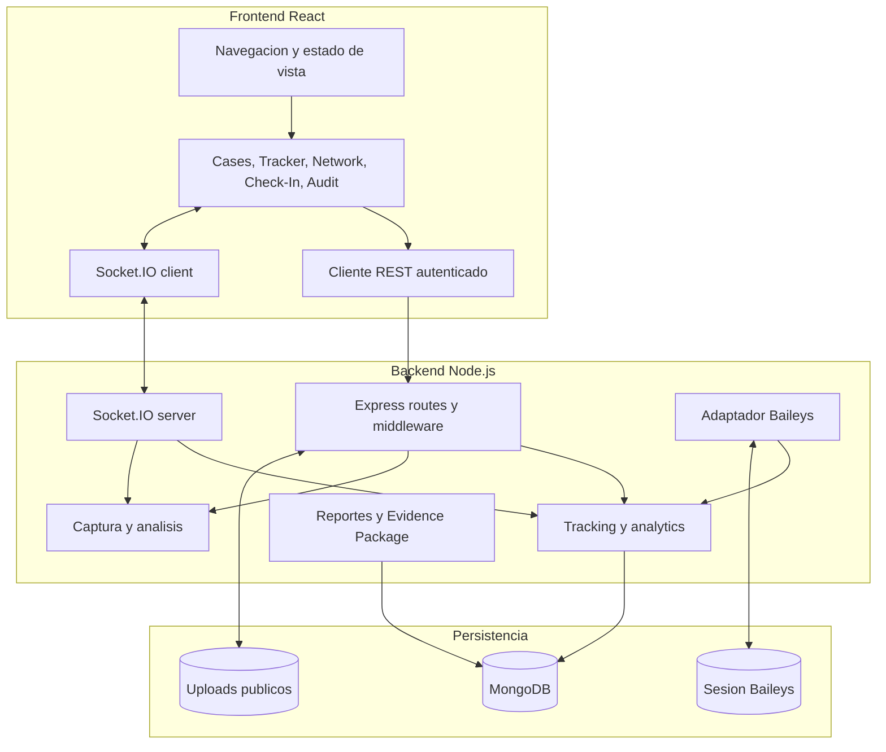

# Diagrama 02: Contenedores y Responsabilidades

## Proposito

Descomponer WP MONITOR en unidades ejecutables y almacenes. Un contenedor en esta vista es una responsabilidad desplegable/logica, no necesariamente un contenedor Docker.

## Contratos

- REST reconstruye estado durable y ejecuta CRUD/exportaciones.
- Socket.IO reduce latencia de QR, presencia, llamadas, captura y Check-In.
- MongoDB conserva entidades; Socket.IO no reemplaza persistencia.
- Sesion y uploads necesitan volumenes separados en filesystem efimero.

## Riesgo arquitectonico

`src/server.ts` compone varias responsabilidades. Los dominios nuevos deben preferir servicios y rutas separadas para evitar aumentar el acoplamiento.
