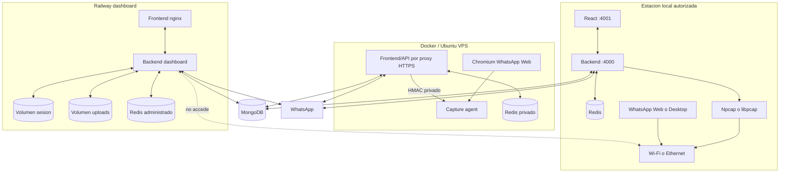

# Diagrama 03: Topologias de Despliegue

## Proposito

Comparar desarrollo local, Docker y Railway, mostrando por que la captura completa permanece en la maquina autorizada.

## Matriz

| Topologia | Captura | URL publica | Persistencia |
| --- | --- | --- | --- |
| Desarrollo local | Opcional, con driver | No requerida | Mongo local/Atlas, Redis y disco local |
| Docker local | No recomendada para NIC host sin configuracion especial | No requerida | Volumenes Docker + Mongo externo |
| Docker/VPS con sidecar | Llamada en namespace del Chromium persistente | HTTPS; noVNC solo por SSH/loopback | Mongo/Redis privados + Baileys/uploads/perfil |
| Railway | Deshabilitada | HTTPS | MongoDB + Redis + dos volumenes |

## Decision

`railway-dashboard` fuerza la frontera correcta: API, tracker, Check-In e informes funcionan, pero la captura queda deshabilitada. En Docker/VPS, el backend sigue sin privilegios y solo el sidecar observa el namespace de Chromium.
