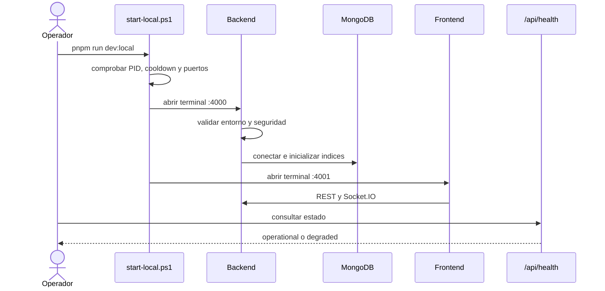

# Diagrama 04: Secuencia de Arranque

## Proposito

Explicar que valida el launcher y como se declara el backend operativo o degradado.

## Puntos de control

1. El script no inicia nada sin orden explicita.
2. No duplica ventanas si detecta procesos/puertos.
3. Produccion falla si el token es ausente o corto.
4. MongoDB desconectado y WhatsApp no vinculado aparecen como razones degradadas.
5. El frontend debe consumir `4000`; un build que apunta a `3001` esta obsoleto.

## Resultado esperado

Antes de vincular QR puede existir un backend saludable pero `degraded` por WhatsApp. Esto no equivale a que Express haya fallado.
