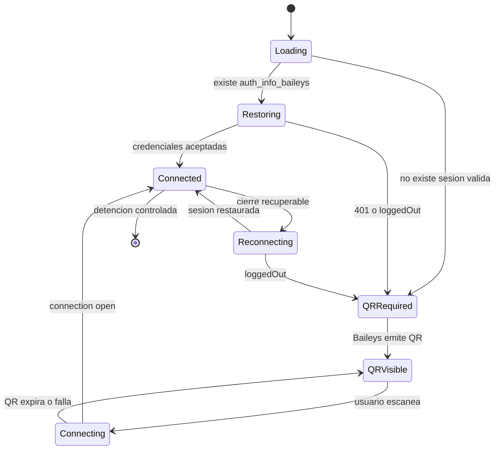

# Diagrama 05: Conexion QR y Sesion WhatsApp

## Proposito

Representar primera vinculacion, restauracion y cierre invalido de la sesion Baileys.

## Eventos visibles

- `qr`: el frontend presenta el codigo vigente.
- `connection-open`: dashboard cambia a conectado.
- health: dependencia `whatsapp.connected` refleja estado del backend.
- `401/loggedOut`: invalida credenciales y requiere vinculacion nueva.

## Operacion segura

No edites archivos de sesion ni los borres por un timeout. Confirma el motivo de cierre, respalda/mueve la sesion solo con autorizacion y vuelve a escanear cuando WhatsApp haya invalidado el dispositivo.
