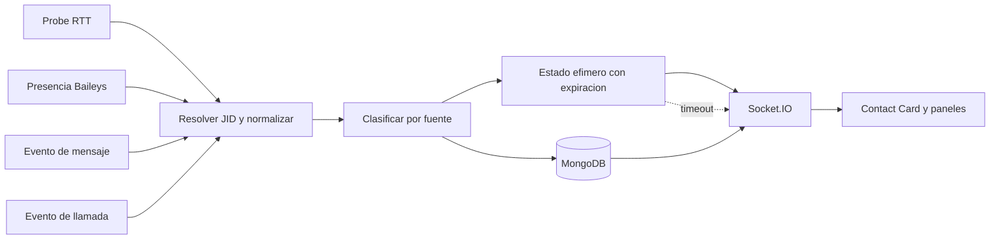

# Diagrama 06: Pipeline de Actividad

## Proposito

Mostrar como RTT, presencia, mensajes y llamadas llegan al dashboard sin perder su fuente.

## Reglas de interpretacion

- RTT es una medicion heuristica, no presencia oficial.
- `composing` y `recording` caducan aunque no llegue un evento de pausa.
- Llamadas conservan direccion y ciclo; no se suman silenciosamente a RTT.
- El dashboard reconstruye historial por REST y recibe actualidad por Socket.IO.

## Fallo que evita

Sin expiracion, `Escribiendo` puede quedar congelado. Sin `source`, las estadisticas pueden mezclar senales incompatibles y producir porcentajes falsos.
