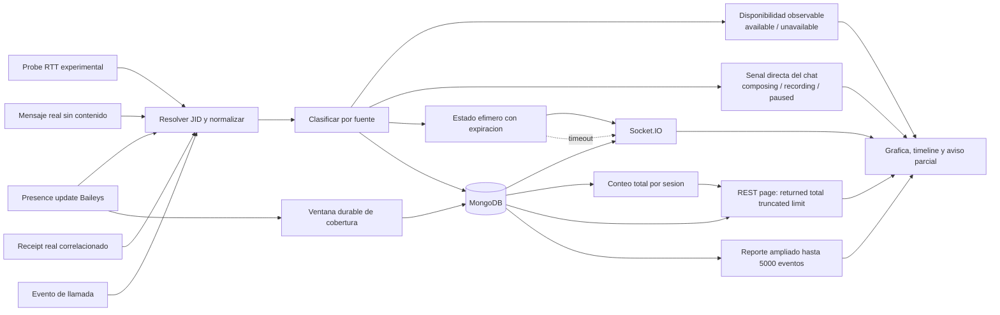

# Diagrama 06: Pipeline de Actividad

## Proposito

Mostrar como RTT experimental, presencia, mensajes reales, receipts y llamadas llegan al dashboard sin perder su fuente.

## Reglas de interpretacion

- El modo predeterminado es pasivo y no genera probes; RTT solo existe cuando el modo experimental fue habilitado y seleccionado.
- RTT es una medicion heuristica, no presencia oficial; un timeout queda como no concluyente.
- Mensaje y Receipt no contienen texto ni ID crudo persistido; la correlacion durable usa una huella opaca.
- `composing` y `recording` caducan aunque no llegue un evento de pausa.
- `available` y `unavailable` describen disponibilidad compartida en un instante;
  pueden recibirse sin conversacion directa, pero no revelan destinatarios ni
  llamadas o mensajes con terceros.
- `composing`, `recording` y `paused` se presentan como senales directas del chat
  con la cuenta vinculada y no se mezclan con disponibilidad general.
- La suscripcion y su heartbeat forman ventanas de cobertura independientes de
  los eventos del contacto; una interrupcion reduce cobertura, no demuestra
  desconexion del contacto.
- Llamadas conservan direccion y ciclo; no se suman silenciosamente a RTT.
- El dashboard reconstruye historial por REST y recibe actualidad por Socket.IO.
- La vista carga hasta 200 eventos y declara `returned`, `total`, `truncated` y `limit`; el reporte ampliado declara su propio limite de 5000.

## Fallo que evita

Sin expiracion, `Escribiendo` puede quedar congelado. Sin `source`, las estadisticas pueden mezclar senales incompatibles y producir porcentajes falsos. Sin metadata de pagina, una muestra parcial podria presentarse incorrectamente como historial completo.
