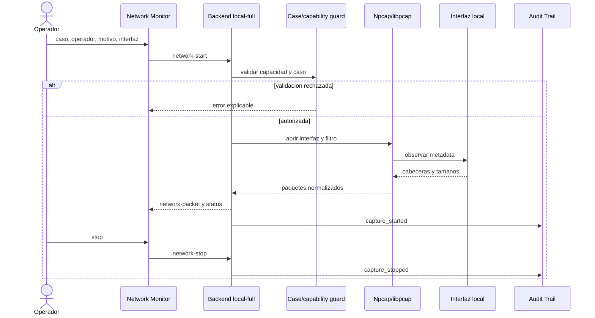

# Diagrama 07: Captura de Red Local

## Proposito

Describir requisitos, control de autorizacion y flujo de metadata desde la interfaz hasta el operador.

## Entradas obligatorias

- `Case ID` existente y operativo;
- operador y autorizacion;
- interfaz realmente activa;
- modo y bandera de captura;
- driver y privilegios del sistema.

## Salida

Metadata temporal, protocolo, IP origen/destino, tamano, TTL, contadores, clasificacion y exportaciones. El flujo normal no necesita contenido de mensajes ni payload de aplicacion.

## Frontera con captura de llamada

Este diagrama describe Network Monitor general y permanece nativo en el backend `local-full`. En Docker/VPS, la captura de llamada usa otro contrato: `capture-agent` comparte exclusivamente el namespace de `wa-browser`; `LOCAL_CAPTURE_ENABLED=false` evita otorgar acceso general al backend.
