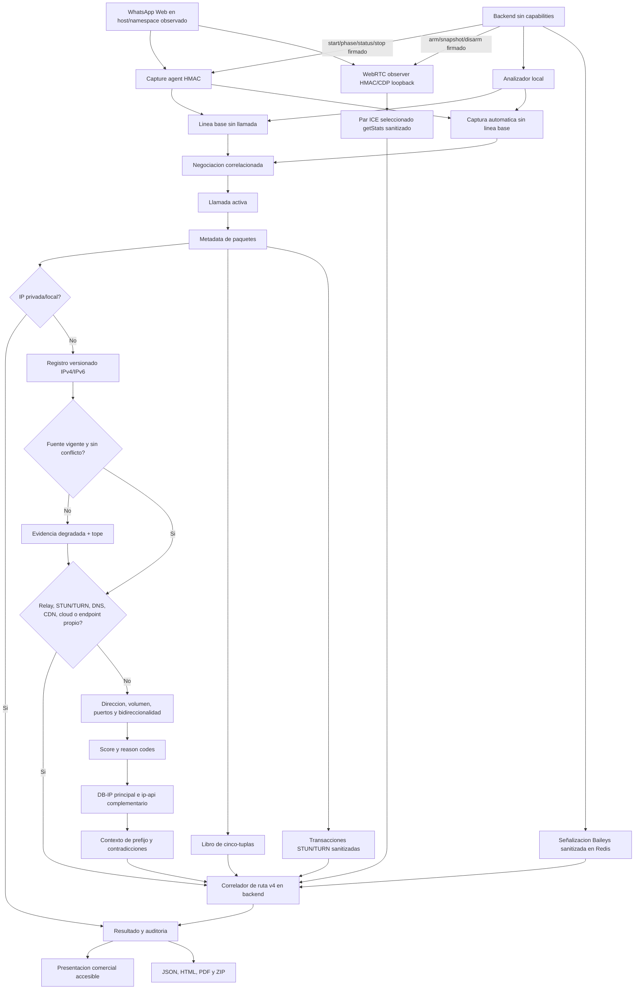

# Diagrama 08: Analisis de Trafico de Llamada

## Proposito

Explicar como una ventana de paquetes se convierte en infraestructura, relays y candidatas con score.

El numero/JID identifica el contacto operativo y permite relacionar el analisis con el caso. No existe una transformacion matematica ni un endpoint que convierta el numero telefonico en una IP.

## Decisiones

- La linea base ayuda a separar conexiones permanentes del trafico nuevo.
- Infraestructura se conserva en el resultado; no se borra para fabricar una candidata.
- Version, CIDR, fuente y vigencia acompañan cada coincidencia del registro.
- Una salida publica propia aprendida por STUN nunca se atribuye al contacto.
- Pocos paquetes limitan la confianza aunque exista flujo bidireccional.
- Prefijo telefonico aporta contexto, no obliga a que GeoIP coincida.
- Proveedores contradictorios deben producir una advertencia u omision de mapa.
- `direct_confirmed` exige coincidencia exacta entre flujo elegible y peer
  Baileys, o entre un par WebRTC seleccionado/exitoso no-relay y una cinco-tupla
  bidireccional elegible con suficiente trafico de negociacion/llamada activa.
- STUN/TURN sin una segunda fuente exacta solo aporta contexto; ChannelData no se
  vincula sin un `CHANNEL-BIND` observado.
- DNS, relays, CDN/cloud, salida propia y GeoIP no son evidencia directa aunque
  tengan alto volumen o una ubicacion aparentemente coherente.

## Veredictos

El contrato v4 usa `direct_confirmed`, `direct_probable`, `relay_confirmed`,
`mixed` o `unresolved`. Los valores historicos `p2p`, `relay`, `mixed` e
`insufficient_data` se conservan como alias compatibles. Ninguno confirma por
si solo identidad, dispositivo o ubicacion fisica.

La pestaña Llamada consume la conclusion v4 sin crear otra vista. Presenta
confianza, procedencia, candidato principal, razones y alcance con lenguaje
comercial; una captura historica sin `routeAssessment` se identifica como tal.
Los reportes JSON, HTML, PDF y ZIP conservan la misma conclusion.
