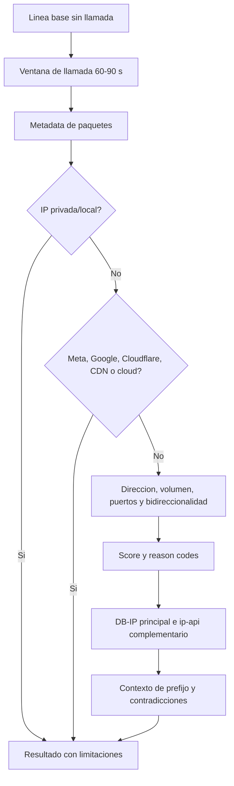

# Diagrama 08: Analisis de Trafico de Llamada

## Proposito

Explicar como una ventana de paquetes se convierte en infraestructura, relays y candidatas con score.

El numero/JID identifica el contacto operativo y permite relacionar el analisis con el caso. No existe una transformacion matematica ni un endpoint que convierta el numero telefonico en una IP.

## Decisiones

- La linea base ayuda a separar conexiones permanentes del trafico nuevo.
- Infraestructura se conserva en el resultado; no se borra para fabricar una candidata.
- Pocos paquetes limitan la confianza aunque exista flujo bidireccional.
- Prefijo telefonico aporta contexto, no obliga a que GeoIP coincida.
- Proveedores contradictorios deben producir una advertencia u omision de mapa.

## Veredictos

`direct`, `relay`, `mixed` o evidencia insuficiente describen la ruta observada. Ninguno confirma por si solo identidad, dispositivo o ubicacion fisica.
