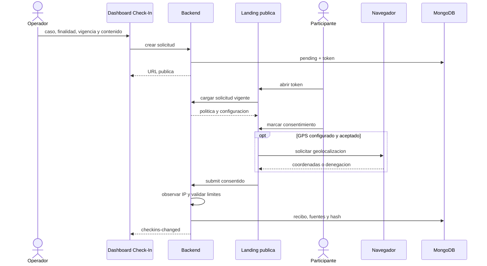

# Diagrama 09: Check-In Autorizado

## Proposito

Separar configuracion del operador, consentimiento del participante, datos observados y recibo de integridad.

## Fuentes

- servidor: IP observada y hora de recepcion;
- navegador: sistema, idioma, pantalla y capacidades declaradas;
- GPS: solo si se solicita y se permite;
- GeoIP: enriquecimiento aproximado separado.

El hash protege el recibo generado; no garantiza que el cliente haya declarado datos verdaderos.
