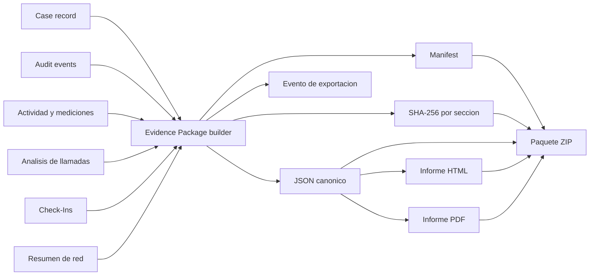

# Diagrama 10: Evidencia, Informes y Exportacion

## Proposito

Mostrar como datos de varias fuentes se consolidan sin perder su procedencia.

## Reglas

- JSON conserva estructura; HTML/PDF priorizan lectura humana.
- El ZIP incluye manifiesto y archivos verificables.
- Una exportacion genera auditoria y por tanto puede cambiar una exportacion posterior.
- Secrets, sesion Baileys y credenciales se excluyen.
- Hash e informe deben corresponder exactamente a los bytes entregados.
