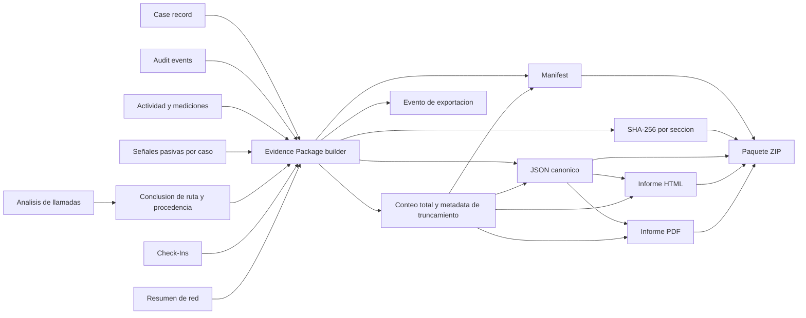

# Diagrama 10: Evidencia, Informes y Exportacion

## Proposito

Mostrar como datos de varias fuentes se consolidan sin perder su procedencia.

## Reglas

- JSON conserva estructura; HTML/PDF priorizan lectura humana.
- La conclusion de ruta conserva clasificacion, score, fuentes, razones y
  limitaciones en JSON/CSV; HTML/PDF traducen esos mismos datos sin elevar la
  certeza. El ZIP contiene todas las representaciones.
- Las señales pasivas y las mediciones RTT se exportan en secciones distintas; ausencia de RTT no elimina actividad real observada.
- El paquete 1.2 incluye `observed-activity.json` y su anexo CSV sin contenido ni IDs crudos de mensajes.
- La actividad observada se limita a 5000 eventos agregados y 250 targets. El
  manifiesto declara cobertura, truncamiento y si el total es un limite inferior;
  HTML/PDF advierten cuando el anexo no contiene el total disponible.
- El ZIP incluye manifiesto y archivos verificables.
- Una exportacion genera auditoria y por tanto puede cambiar una exportacion posterior.
- Secrets, sesion Baileys y credenciales se excluyen.
- Hash e informe deben corresponder exactamente a los bytes entregados.
