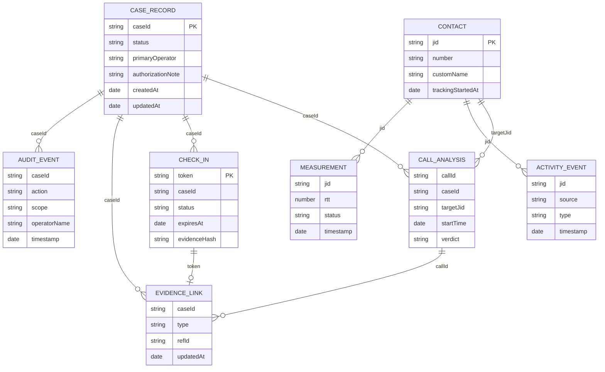

# Diagrama 11: Modelo de Datos MongoDB

## Proposito

Visualizar relaciones logicas. MongoDB no aplica claves foraneas; la aplicacion conserva coherencia mediante `caseId`, `jid`, `callId`, `token` y enlaces de evidencia.

## Retencion

Mediciones tienen TTL de 30 dias; actividad y analisis de llamada, 90 dias. Casos, auditoria, contactos, enlaces y Check-Ins requieren politica explicita de retencion.
