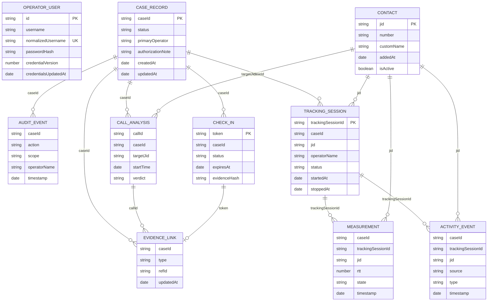

# Diagrama 11: Modelo de Datos MongoDB

## Proposito

Visualizar relaciones logicas. MongoDB no aplica claves foraneas; la aplicacion conserva coherencia mediante `caseId`, `jid`, `callId`, `token` y enlaces de evidencia.

## Retencion

Mediciones tienen TTL de 30 dias; actividad y analisis de llamada, 90 dias. Operador, casos, sesiones de tracking, auditoria, contactos, enlaces y Check-Ins requieren politica explicita de retencion. Solo existe `primary-operator`; `normalizedUsername` tambien es unico y `passwordHash` nunca contiene texto plano. Los documentos historicos previos al modelo por caso pueden no contener `caseId` o `trackingSessionId` y se excluyen de evidencia por caso.
