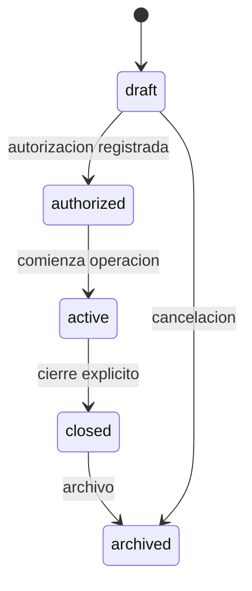
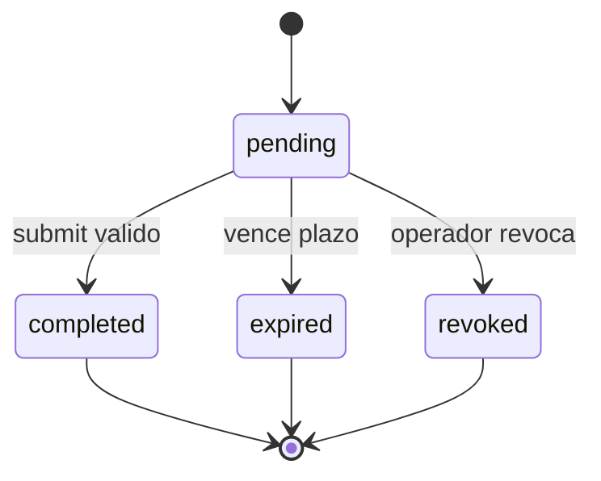
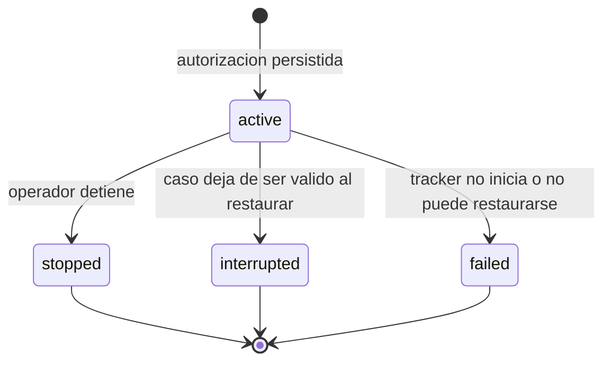
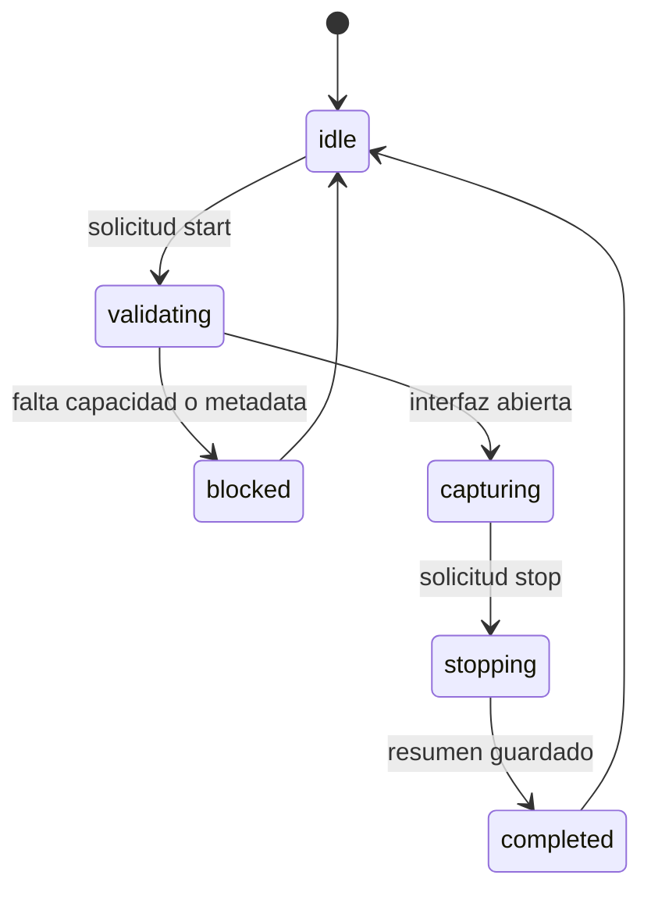
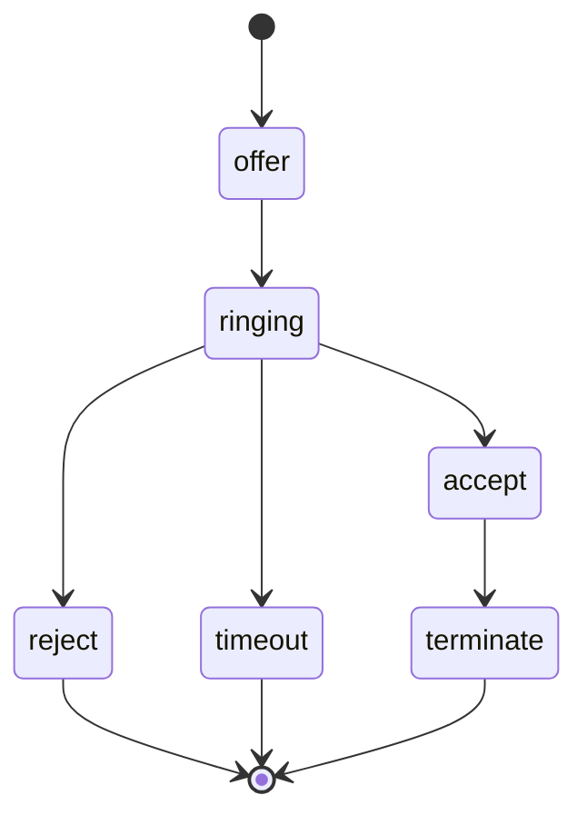

# Diagrama 12: Maquinas de Estado

## Casos

## Check-In

## Sesion de tracking

Un caso con una sesion `active` no puede cerrarse ni pasar a un estado no activo. Una nueva reactivacion crea otra sesion con metadata de autorizacion vigente.

## Captura

## Llamada observada

## Nota

La maquina de llamada representa estados que Baileys puede entregar. La aplicacion no debe inventar transiciones faltantes. Captura y llamada son ciclos distintos: observar una llamada puede activar una captura, pero cada una conserva su propio estado y auditoria.
