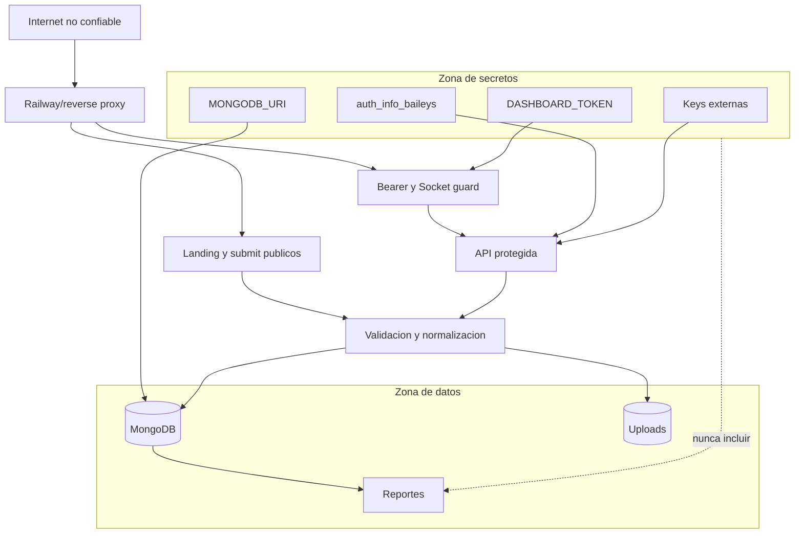

# Diagrama 13: Limites de Confianza y Secretos

## Proposito

Mostrar donde se validan entradas y que activos nunca deben cruzar hacia el repositorio, logs o paquetes de evidencia.

## Controles

- CORS controla navegadores, no reemplaza autenticacion.
- `TRUST_PROXY` limita que cabeceras de IP se consideran confiables.
- Rate limit publico reduce abuso, pero memoria local no escala entre replicas.
- Validacion se aplica antes de persistir o abrir captura.
- Los reportes minimizan y excluyen secretos.
