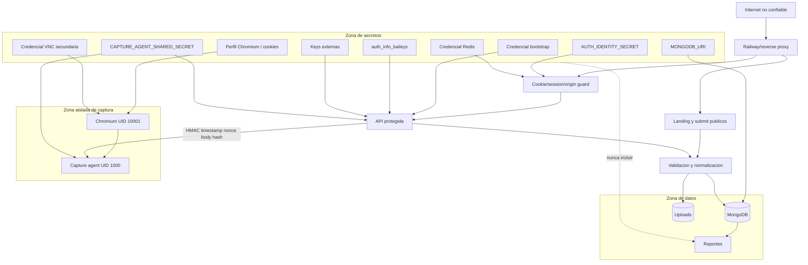

# Diagrama 13: Limites de Confianza y Secretos

## Proposito

Mostrar donde se validan entradas y que activos nunca deben cruzar hacia el repositorio, logs o paquetes de evidencia.

## Controles

- CORS controla navegadores, no reemplaza autenticacion.
- `TRUST_PROXY` limita que cabeceras de IP se consideran confiables.
- Rate limits de login y Check-In se comparten atomicamente en Redis y fallan cerrados.
- La cookie es `HttpOnly` y `SameSite=Strict`; produccion exige HTTPS para `Secure`/`__Host-`.
- Cambiar credenciales revoca sesiones HTTP y Socket.IO anteriores.
- Validacion se aplica antes de persistir o abrir captura.
- Los reportes minimizan y excluyen secretos.
- El puerto del agente no se publica; noVNC se enlaza solo a loopback y requiere tunel SSH.
- El backend no recibe capabilities. El agente conserva solo `NET_RAW/NET_ADMIN` y el navegador ninguna.
- Perfiles Chromium, sesiones Baileys, secretos HMAC/VNC y backups quedan fuera de Git y del contexto Docker.
