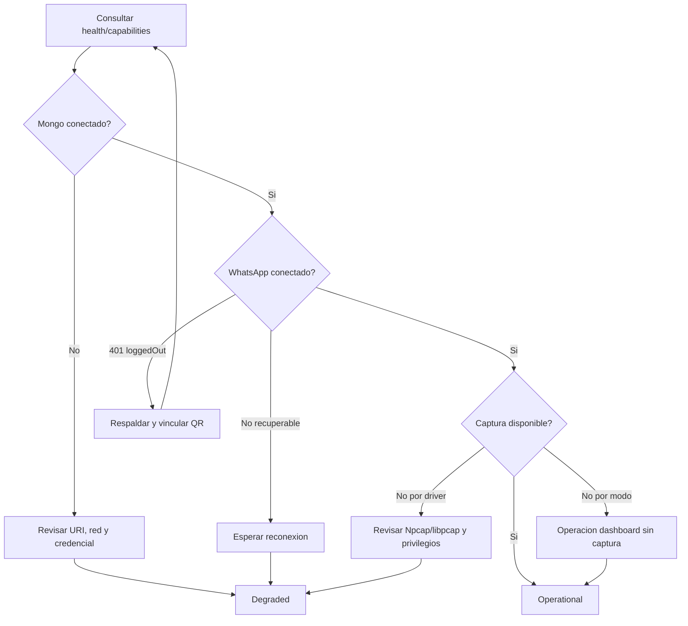

# Diagrama 14: Fallos y Recuperacion

## Proposito

Representar degradacion y accion operativa sin convertir cada warning en un reinicio destructivo.

## Principio

Recuperar significa identificar la capa, aplicar el runbook y verificar estado durable. Borrar sesion, reinstalar dependencias o matar procesos sin diagnostico puede ampliar el incidente.

## Evidencia del incidente

Registra version, timestamp UTC, modo, health, endpoint, primera salida de error y accion tomada. Redacta secretos y datos personales.
