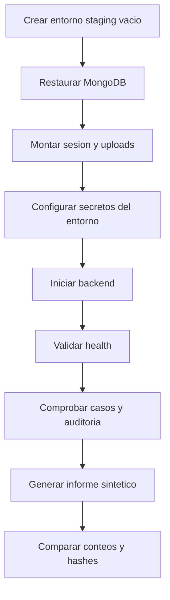

# Backup y Recuperacion

## Alcance

Un respaldo completo considera tres propietarios de datos:

1. MongoDB: casos, contactos, mediciones, auditoria, Check-Ins y analisis.
2. `auth_info_baileys`: credenciales de la sesion vinculada.
3. `public/uploads`: imagenes publicas de preview y uploads autorizados.

Los logs, `dist`, `client/build` y `node_modules` no son respaldo del producto.

## Objetivos sugeridos

La organizacion debe definir RPO y RTO. Para un laboratorio pequeño puede comenzar con:

- RPO: 24 horas para MongoDB y uploads;
- RTO: 4 horas para restaurar staging;
- sesion Baileys: volumen persistente y copia cifrada cuando la politica lo permita;
- prueba de restauracion: mensual y antes de una version mayor.

Estos valores son ejemplos, no una garantia del proyecto.

## MongoDB

Utiliza herramientas oficiales compatibles con tu proveedor. Nunca pongas la URI en el repositorio o en el nombre del archivo.

Ejemplo conceptual:

```text
mongodump --uri <URI_DESDE_SECRET_MANAGER> --db <DB> --archive=<ARCHIVO> --gzip
mongorestore --uri <URI_STAGING> --archive=<ARCHIVO> --gzip --nsFrom=<DB>.* --nsTo=<DB_STAGING>.*
```

Valida conteos de casos, auditoria, Check-Ins y analisis despues de restaurar. No pruebes restauracion sobre produccion.

## Sesion Baileys

- detiene el backend o crea una instantanea consistente del volumen;
- cifra la copia;
- restringe acceso al administrador responsable;
- no la adjuntes a issues ni paquetes de evidencia;
- si existe sospecha de exposicion, cierra dispositivos vinculados y genera una sesion nueva.

La restauracion puede fallar si WhatsApp invalido la sesion. Un `401/loggedOut` requiere nueva vinculacion aunque los archivos existan.

## Uploads

Conserva estructura y nombres bajo `public/uploads`. Verifica que los registros de Check-In referencien archivos existentes y que `PUBLIC_BASE_URL` corresponda al entorno restaurado.

## Procedimiento de restauracion



## Acta de prueba

Registra:

- fecha UTC;
- responsable;
- version de WP MONITOR;
- origen y fecha del backup;
- destino aislado;
- conteos antes/despues;
- hash del archivo de respaldo;
- fallos y tiempo total;
- decision PASS/FAIL.

## Rotacion y borrado

- cifra backups en reposo y transito;
- separa claves del archivo cifrado;
- aplica retencion institucional;
- elimina copias vencidas de forma verificable;
- rota `DASHBOARD_TOKEN`, URI de MongoDB y otras claves despues de exposicion;
- no incluyas secretos en reportes del caso.
