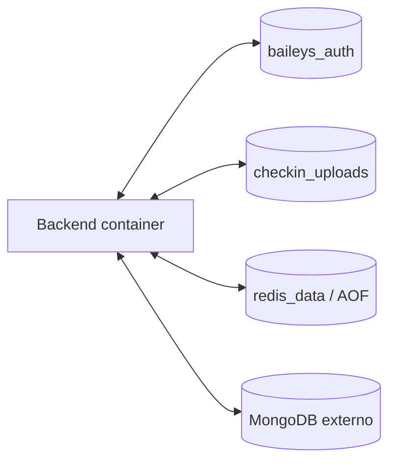

# Operacion con Docker

## Objetivo

Validar imagenes reproducibles de backend/frontend y persistencia local. Docker no sustituye la captura `local-full` en Windows: el contenedor no obtiene automaticamente acceso a la NIC del host ni a Npcap.

## Servicios

| Servicio | Dockerfile | Puerto | Estado durable |
| --- | --- | --- | --- |
| backend | `Dockerfile` | `${BACKEND_PORT:-4000}` | `baileys_auth`, `checkin_uploads`, Mongo externo |
| client | `client/Dockerfile` con contexto raiz | `${CLIENT_PORT:-4001}` | Build estatico |
| redis | imagen oficial `redis:8.10.1-alpine` | Solo red interna | `redis_data` con AOF |

## Preflight

```powershell
docker version
docker compose config
```

Confirma que Docker Desktop/daemon esta activo, `.env` existe, MongoDB es alcanzable desde el contenedor y los puertos estan libres. Redis no publica `6379`; el backend lo alcanza mediante `redis://redis:6379` en `data-network`.

`127.0.0.1` dentro del backend apunta al propio contenedor. Para MongoDB en el host utiliza un nombre/ruta compatible con tu plataforma, o un servicio Mongo dedicado.

## Build

```powershell
docker compose build --pull
```

El frontend necesita el contexto raiz porque copia `package.json`, `pnpm-lock.yaml`, `pnpm-workspace.yaml` y `client/package.json`. `VITE_API_URL` queda embebida durante build.

## Inicio y verificacion

```powershell
docker compose up -d
docker compose ps
docker compose logs --tail 100 backend
docker compose logs --tail 100 client
```

Comprueba:

1. `GET /api/runtime-capabilities`;
2. `GET /api/health`;
3. frontend y autenticacion;
4. Socket.IO;
5. creacion de caso sintetico;
6. preview upload;
7. persistencia tras `docker compose restart`.
8. `docker compose exec backend id` informa `uid=1000(node)` y el backend no puede modificar `/app/dist/server.js`.

## Persistencia



No montes un volumen sobre `/app` completo: ocultaria el codigo de la imagen. Los volumenes deben apuntar exactamente a `/app/auth_info_baileys` y `/app/public/uploads`.

El proceso backend se ejecuta como el usuario no privilegiado `node` (`UID/GID 1000`). La imagen conserva el codigo y las dependencias sin permiso de escritura para ese usuario, y solo concede escritura a `/app/auth_info_baileys` y `/app/public/uploads`. Los volumenes nombrados del Compose incluido se inicializan con esos permisos. Si reemplazas esos volumenes por bind mounts del host, prepara ambos directorios para que `1000:1000` pueda escribir sin ejecutar el servicio como `root`.

## Actualizacion

1. respalda MongoDB/volumenes;
2. construye nueva imagen;
3. ejecuta pruebas en staging;
4. conserva imagen/tag anterior;
5. despliega;
6. valida health, sesion, upload e informe;
7. revierte si falla un control critico.

## Detencion

```powershell
docker compose down
```

No agregues `-v` salvo que pretendas eliminar los volumenes y hayas verificado el objetivo. `down -v` destruye persistencia local de sesion Baileys, uploads y Redis.

## Limitaciones

- La imagen backend instala `libpcap-dev`, pero el acceso a interfaces del host depende de plataforma, red y privilegios.
- Para captura confiable en Windows usa el runbook local fuera de Docker.
- Compose incluye Redis con AOF, healthcheck y volumen, pero no incluye MongoDB; debes proporcionarlo.
- No existe healthcheck Docker declarado en el compose actual; utiliza endpoints como smoke externo.
