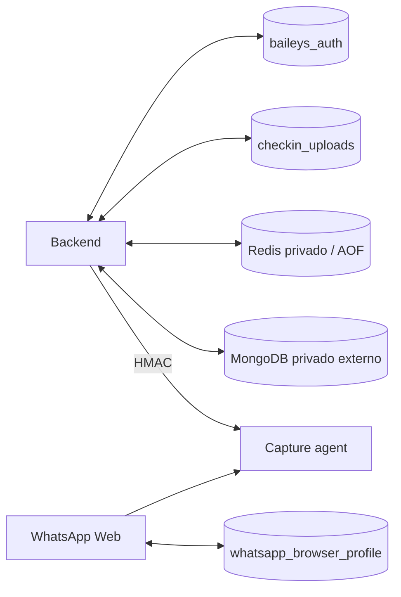

# Operacion con Docker

## Objetivo

Ejecutar WP MONITOR con procesos aislados, persistencia explicita y captura de llamadas en el mismo namespace de red que Chromium. MongoDB permanece como servicio privado independiente; el Compose del repositorio no crea ni publica una segunda base.

## Servicios

| Servicio | Proposito | Acceso | Persistencia/privilegio |
| --- | --- | --- | --- |
| `backend` | REST, Socket.IO, Baileys, casos e informes | `127.0.0.1:4000` por defecto | `baileys_auth`, `checkin_uploads`; sin capabilities |
| `client` | Nginx no-root con build React | `127.0.0.1:4001` por defecto | Stateless |
| `redis` | Sesiones y limites compartidos en Compose local | Solo `data-network` | `redis_data`, AOF, sin puerto host; PID final sin capabilities |
| `wa-browser` | Chromium/WhatsApp Web, Xvfb y audio virtual | `127.0.0.1:7900` | `whatsapp_browser_profile`; UID 10001, sin capabilities |
| `capture-agent` | Captura UDP de la ventana de llamada | Sin puerto host | Comparte namespace de `wa-browser`; PID 1 UID 1000 con solo `NET_RAW/NET_ADMIN` |

El agente recibe inicialmente capacidades auxiliares de Docker para bajar UID/GID; su entrypoint elimina `SETUID`, `SETGID` y `SETPCAP` antes de ejecutar Node. Redis recibe durante bootstrap `CHOWN`, `DAC_OVERRIDE`, `FOWNER`, `SETUID`, `SETGID` y `SETPCAP`: su entrypoint oficial corrige un volumen AOF nuevo, cambia a UID 999/GID 1000 y elimina todo el bounding set antes de ejecutar el servidor. El backend nunca recibe privilegios de captura en este modelo.

El Compose fuerza `LOCAL_CAPTURE_ENABLED=false` y `CALL_CAPTURE_MODE=agent` aunque la plantilla nativa indique modo local; no otorgues capabilities al backend para reactivar el Monitor de red general. La URL del agente tambien queda fijada a su origen interno. El secreto y timeout siguen viniendo del entorno privado.

En el VPS auditado aplica tambien `deploy/docker-compose.dokploy.yml`: usa `server-full`, reutiliza MongoDB/Redis en la red externa `wp-monitor-data`, desactiva el Redis local y retira las publicaciones host de backend/cliente. No ejecutes ese override en una maquina sin los servicios de estado externos.

## Preflight

1. Crea `.env` desde `.env.example`.
2. Configura una URI MongoDB privada alcanzable desde `backend`. Si MongoDB corre en el mismo host Linux, usa `host.docker.internal` en la URI y limita el listener/firewall al host; `127.0.0.1` dentro del contenedor apunta al propio backend.
3. Genera valores distintos para `AUTH_IDENTITY_SECRET` y `CAPTURE_AGENT_SHARED_SECRET`, ambos de 32 bytes o mas.
4. Define una contraseña VNC aleatoria de 15 o mas caracteres. El servicio falla cerrado con una menor, aunque la autenticacion VNC tradicional solo usa los primeros ocho significativos; el control principal es que `7900` permanezca en loopback y se acceda por SSH.
5. Verifica que MongoDB no publique `27017` y que ningun servicio externo use `4000`, `4001` o `7900`.

```bash
docker version
docker compose config --quiet
```

No ejecutes `docker compose config` en tickets o logs publicos: el render puede contener valores de entorno.

## Build e inicio

```bash
docker compose build --pull
docker compose up -d
docker compose ps
```

Estados esperados: `backend`, `client`, `redis`, `wa-browser` y `capture-agent` en `healthy`. El backend espera Redis y el agente; el agente espera el navegador.

En Dokploy/VPS valida e inicia con ambos archivos; conserva el `-p` real ya existente:

```bash
docker compose -f docker-compose.yml -f deploy/docker-compose.dokploy.yml config --quiet
docker compose -p NOMBRE_EXISTENTE -f docker-compose.yml -f deploy/docker-compose.dokploy.yml up -d --build --remove-orphans
```

Alli se esperan cuatro contenedores nuevos/actualizados (`backend`, `client`, `wa-browser`, `capture-agent`) y los MongoDB/Redis privados ya operativos. `redis` no debe aparecer como servicio nuevo.

## Primer enlace de WhatsApp Web

Desde la computadora del operador crea un tunel SSH:

```bash
ssh -L 7900:127.0.0.1:7900 USER@VPS
```

Abre `http://127.0.0.1:7900/vnc.html`, introduce la contraseña y enlaza WhatsApp Web. No enrutes `7900` por Dokploy, Cloudflare, Nginx ni el firewall publico. El perfil queda en `whatsapp_browser_profile` y sobrevive a recreaciones normales.

El entrypoint mantiene un lock exclusivo propio sobre el volumen. Tras una detencion no limpia elimina unicamente marcadores `SingletonLock`, `SingletonCookie` y `SingletonSocket` obsoletos, y solo despues de adquirir ese lock. Nunca montes el mismo perfil en dos navegadores simultaneos.

## Verificacion operativa

```bash
curl --fail http://127.0.0.1:4000/api/health/live
curl --fail http://127.0.0.1:4001/healthz
docker compose ps
```

Comprueba ademas:

1. login, logout y cambio de credenciales;
2. MongoDB/Redis conectados y WhatsApp enlazado en `/api/health`;
3. `callCapture.mode=agent` y `available=true`;
4. Chromium sin `--no-sandbox`, UID 10001 y `CapEff=0`;
5. PID 1 del agente con UID/GID 1000, `NoNewPrivs=1` y capabilities efectivas `NET_RAW/NET_ADMIN` solamente;
6. PID 1 de Redis con UID 999/GID 1000, `NoNewPrivs=1` y `CapEff/CapBnd=0`;
7. `7900` enlazado unicamente a `127.0.0.1`, y backend/cliente sin publicaciones host en Dokploy;
8. una captura UDP sintetica antes de utilizar una llamada real autorizada;
9. caso, llamada, persistencia, informe y auditoria con datos de prueba.

`docker exec capture-agent id` abre por defecto un proceso auxiliar como root y no demuestra el usuario del servicio. Consulta `/proc/1/status` para auditar PID 1.

## Persistencia



No montes un volumen sobre `/app` completo. No uses `docker compose down -v` durante actualizaciones: elimina sesiones, uploads, Redis y el perfil WhatsApp Web.

## Backup y actualizacion

Sigue [Backup y recuperacion](backup-recovery.md). El backup cifrado incluye MongoDB, Baileys, uploads, Redis y el perfil Chromium. La restauracion automatizada incluida se limita intencionalmente a MongoDB staging; restaurar sesiones autenticadas exige un procedimiento de desastre revisado.

Actualizacion:

1. verifica un backup cifrado reciente;
2. conserva los digests/tags anteriores;
3. construye y prueba en staging;
4. recrea sin `-v`;
5. valida health, perfil, llamada sintetica, reporte y logs;
6. revierte imagen/configuracion si falla un control critico.

## Detencion

```bash
docker compose down
```

Esta orden retira contenedores/red del proyecto y conserva volumenes. No borres volumenes para solucionar un healthcheck.

## Limitaciones y riesgo residual

- El Network Monitor general sigue siendo una funcion nativa `local-full`; el sidecar esta dedicado al trafico del navegador.
- Chromium usa su sandbox interno, UID no-root, `no-new-privileges`, rootfs de solo lectura y capabilities vacias. El contenedor necesita `seccomp=unconfined` porque el perfil Docker predeterminado bloquea las operaciones de namespace requeridas por ese sandbox; esta excepcion queda limitada al navegador.
- noVNC no ofrece el limite de confianza principal: SSH/loopback si lo hacen.
- Un relay, VPN o CGNAT puede impedir observar una ruta directa. Una candidata nunca prueba identidad ni ubicacion exacta.
- MongoDB debe suministrarse como servicio privado independiente y entrar en la politica de backup.
