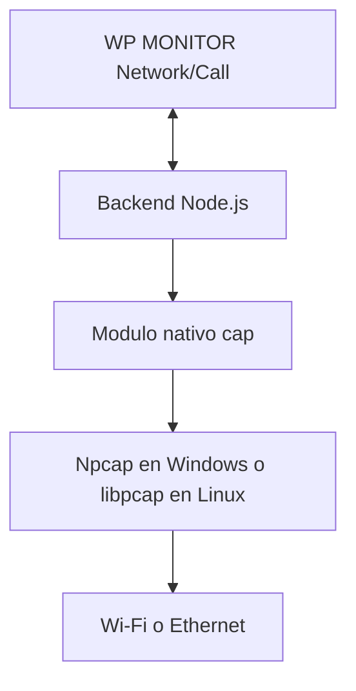

# Instalacion del Motor de Captura Local

## Objetivo

Preparar el sistema operativo para que el modulo Node.js `cap` pueda enumerar interfaces y observar metadata de paquetes. Esta instalacion habilita **Network Monitor** y **Analisis de Llamadas**; no obtiene automaticamente la IP de un numero ni concede autorizacion para capturar trafico.

La captura debe ejecutarse en la misma computadora donde corre WhatsApp Web/Desktop y solamente sobre una interfaz autorizada.

## Capas necesarias



Si una capa falta, `LOCAL_CAPTURE_ENABLED=true` no la instala ni la reemplaza.

## Windows 10/11: Npcap

### 1. Descargar desde la fuente oficial

Utiliza solamente [npcap.com](https://npcap.com/) y consulta la [guia oficial de instalacion](https://npcap.com/guide/npcap-users-guide.html). No incluyas el instalador dentro del repositorio de WP MONITOR.

### 2. Cerrar aplicaciones de captura

Cierra Wireshark, Nmap y procesos que puedan mantener el driver ocupado. Conserva una copia de la configuracion si reemplazaras una instalacion anterior.

### 3. Ejecutar el instalador como administrador

Durante la instalacion marca:

- **Install Npcap in WinPcap API-compatible Mode**: necesario para herramientas que esperan la API WinPcap, como el stack utilizado por `cap`.

Opciones a decidir segun la politica del equipo:

- **Restrict Npcap driver's access to Administrators only**: reduce usuarios con acceso, pero obliga a ejecutar WP MONITOR elevado.
- **Support raw 802.11 traffic**: no es necesaria para el flujo normal de WP MONITOR.
- loopback: opcional; Network Monitor se centra normalmente en Wi-Fi/Ethernet.

No instales el WinPcap antiguo. El propio proyecto WinPcap recomienda Npcap y WinPcap ya no se mantiene.

### 4. Reiniciar terminal o equipo

Al menos cierra y vuelve a abrir PowerShell/VS Code. Si el driver no aparece, reinicia Windows antes de diagnosticar el codigo.

### 5. Instalar/reconstruir dependencias

Desde la raiz:

```powershell
corepack enable
pnpm install --frozen-lockfile
pnpm rebuild cap
```

`cap` contiene bindings nativos. Necesita una version compatible de Node y herramientas de compilacion que pnpm/node-gyp pueda utilizar.

### 6. Verificar que Node carga `cap`

```powershell
node -e "import('cap').then(() => console.log('CAP_MODULE_OK')).catch(error => { console.error(error); process.exit(1) })"
```

Resultado esperado:

```text
CAP_MODULE_OK
```

Si aparece error de DLL o binding, revisa arquitectura Node x64, instalacion Npcap, modo compatible y recompila `cap`.

### 7. Ejecutar WP MONITOR elevado cuando corresponda

Abre PowerShell o VS Code **como Administrador** solamente para la practica de captura. No uses privilegios elevados para navegar, editar o ejecutar tareas no relacionadas.

## Linux

Los nombres varian por distribucion. La implementacion upstream es [libpcap](https://github.com/the-tcpdump-group/libpcap).

### Debian/Ubuntu

```bash
sudo apt update
sudo apt install -y libpcap-dev build-essential python3
corepack enable
pnpm install --frozen-lockfile
pnpm rebuild cap
```

### Fedora/RHEL compatibles

```bash
sudo dnf install -y libpcap-devel gcc-c++ make python3
corepack enable
pnpm install --frozen-lockfile
pnpm rebuild cap
```

### Arch Linux

```bash
sudo pacman -S --needed libpcap base-devel python
corepack enable
pnpm install --frozen-lockfile
pnpm rebuild cap
```

### Privilegios Linux

La forma simple en un laboratorio aislado es iniciar el proceso de captura con privilegios suficientes. No ejecutes instalaciones pnpm como root. Asignar capacidades directamente al binario global de Node afecta todas las aplicaciones que lo usan y debe evaluarse por seguridad; para produccion se recomienda aislar la captura en un ejecutable/servicio dedicado con minimo privilegio.

## Configuracion WP MONITOR

Despues de instalar el driver:

```env
DEPLOYMENT_MODE=local-full
LOCAL_CAPTURE_ENABLED=true
BACKEND_PORT=4000
CLIENT_PORT=4001
```

Inicia:

```powershell
pnpm run dev:local
```

## Verificacion funcional

### 1. Capacidades

```powershell
Invoke-RestMethod http://127.0.0.1:4000/api/runtime-capabilities
```

Debe incluir:

```json
{
  "localCapture": true,
  "networkMonitor": true,
  "callTrafficAnalysis": true
}
```

Esto solo confirma configuracion; todavia no prueba driver o privilegios.

### 2. Interfaces

```powershell
Invoke-RestMethod http://127.0.0.1:4000/api/network/interfaces
```

Con `DASHBOARD_TOKEN`, agrega la cabecera Bearer. Debe aparecer al menos la interfaz activa con una direccion que coincida con la red del equipo.

### 3. Prueba de primer paquete

1. crea un caso `LAB-CAPTURE-001`;
2. completa operador y autorizacion;
3. selecciona Wi-Fi/Ethernet;
4. inicia captura durante 10-15 segundos sin llamada;
5. abre una pagina propia para generar trafico normal;
6. confirma `Primer paquete capturado` y contadores mayores a cero;
7. detiene la captura;
8. revisa Audit Trail.

No uses una llamada hasta superar esta prueba. Si la captura general no ve paquetes, el analisis de llamada tampoco sera confiable.

## Diagnostico

| Sintoma | Causa probable | Accion |
| --- | --- | --- |
| `cap` no carga | Binding/DLL/Node incompatible | Reinstalar deps, `pnpm rebuild cap`, revisar Node 20 x64 |
| Interfaces vacias | Driver ausente o permiso | Verificar Npcap/libpcap y ejecutar elevado |
| Interfaz aparece, cero paquetes | NIC incorrecta, VPN o firewall | Comparar IP local y probar otra interfaz |
| Access denied | Restriccion admin/capability | Elevar solo proceso autorizado |
| Captura funciona, llamada no | WhatsApp corre en otro equipo/interfaz | Ejecutar llamada en la misma maquina |
| Railway muestra bloqueo | Comportamiento esperado | Captura solo en `local-full` |

## Seguridad y licencia

- No redistribuyas el instalador gratuito de Npcap con WP MONITOR. La pagina oficial indica restricciones de cantidad/redistribucion y ofrece licencias OEM para uso institucional o distribucion.
- El repositorio puede enlazar al proveedor y pedir instalacion manual.
- Una organizacion debe revisar la licencia vigente antes de desplegar en multiples equipos.
- Captura metadata minima, limita la ventana y conserva autorizacion.
- Elimina exports de laboratorio segun la politica de retencion.

## Criterio de exito

- modulo `cap` carga;
- capabilities habilitadas;
- interfaz activa visible;
- primer paquete capturado;
- stop libera la captura;
- evento ligado al Case ID;
- no se instalaron binarios de terceros dentro del repositorio;
- limitaciones y licencia comprendidas.
