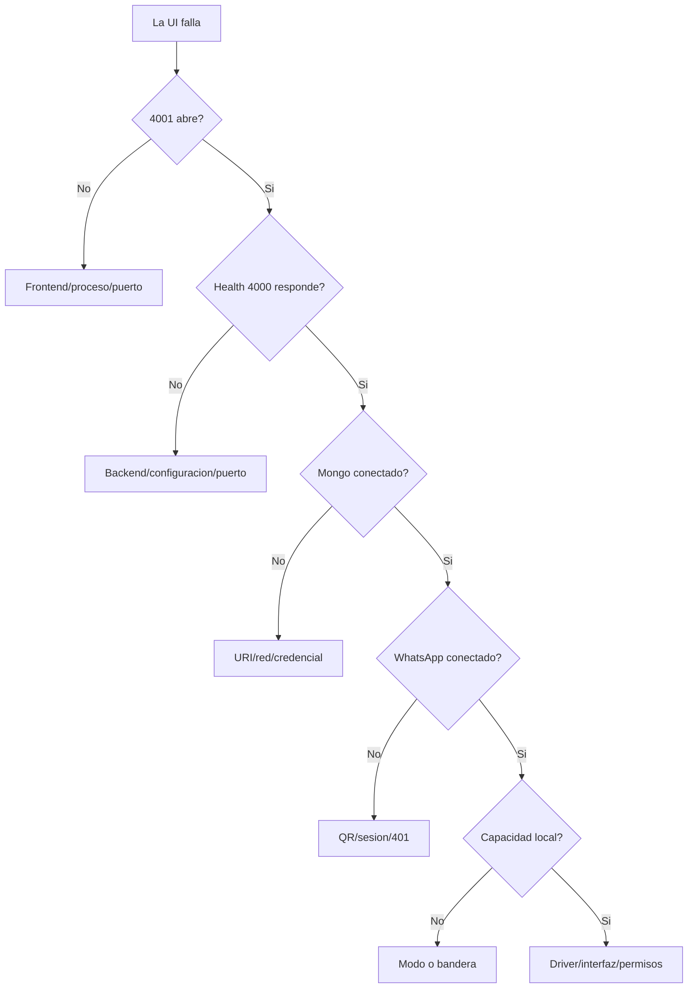

# Troubleshooting

Diagnostica por capas. Conserva la primera salida de error y evita borrar datos hasta identificar la causa.

## Arbol inicial

## Frontend consulta 3000/3001

**Sintoma:** `ERR_CONNECTION_REFUSED` hacia puertos antiguos.

**Revision:**

- `VITE_API_URL` durante build;
- `client/src/auth.ts` usa fallback `http://localhost:4000`;
- limpia/reconstruye el frontend si la variable estaba incrustada;
- confirma CORS para `4001`.

## Failed to fetch

Comprueba en orden:

1. backend escuchando;
2. `/api/health` accesible;
3. protocolo HTTP/HTTPS compatible;
4. origen permitido;
5. sesion de operador vigente y cookie aceptada;
6. respuesta JSON y no una pagina HTML de proxy/404.

`Unexpected token '<'` suele significar que el cliente esperaba JSON y recibio HTML.

## Login o API responde 401/403

- `401`: confirma usuario actual, sesion no expirada, MongoDB/Redis conectados y vuelve a iniciar sesion;
- `403` en una mutacion: confirma que el `Origin` del frontend coincide exactamente con `ALLOWED_ORIGINS`;
- en produccion confirma HTTPS extremo a extremo para que el navegador envie la cookie `Secure`;
- cambiar `INITIAL_ADMIN_USERNAME` o `INITIAL_ADMIN_PASSWORD` no restablece una cuenta ya creada; usa **Account** mientras conserves acceso;
- no intentes autenticar con cabecera Bearer: el contrato anterior fue retirado.

## WhatsApp no muestra QR

- revisa si ya existe sesion abierta;
- observa logs de `connection.update`;
- espera una transicion, no reinicies repetidamente;
- si existe `401/loggedOut` confirmado, respalda/mueve la sesion y vincula de nuevo;
- no edites archivos de `auth_info_baileys` manualmente.

## Estado congelado en Escribiendo

- consulta `/api/contact/:jid/live-state`;
- compara timestamp y expiracion;
- confirma evento `contact-live-state` por Socket.IO;
- revisa que el frontend aplique estado `expired`;
- diferencia presencia actual de ultimo evento historico.

## Llamada entrante no detectada

Baileys solo permite registrar lo que WhatsApp entrega a la sesion vinculada. Revisa eventos `call` crudos, direccion y estados oficiales. No sintetices `ringing` o `busy` sin evento. Documenta cobertura de la version y prueba ambas direcciones con cuentas propias.

## Start Capture deshabilitado

- `/api/runtime-capabilities` debe indicar `localCapture: true`;
- modo `local-full` y bandera `true`;
- Case ID, operador y autorizacion completos;
- interfaz seleccionada;
- driver cargado;
- permisos de administrador/root.

## Captura activa pero cero paquetes

- confirma direccion de interfaz actual;
- desactiva VPN/adaptadores virtuales para diagnostico autorizado;
- verifica que WhatsApp corre en la misma maquina;
- revisa firewall/antivirus;
- ejecuta linea base y confirma primer paquete.

En Docker/VPS distingue proveedor `agent`: confirma `wa-browser` y `capture-agent` healthy, mismo namespace, interfaz no-loopback y trafico originado dentro de Chromium. El agente no puede observar una llamada iniciada en la laptop o el telefono.

## Chromium o capture-agent unhealthy

- revisa el primer `browser startup error`, no solo el ultimo restart;
- `profile is in use` debe recuperarse con el entrypoint suministrado; no borres el volumen;
- confirma que existe un solo contenedor montando `whatsapp_browser_profile`;
- valida Chromium UID 10001, sin capabilities y sin `--no-sandbox`;
- valida agente PID 1 UID/GID 1000, `NoNewPrivs=1` y solo `NET_RAW/NET_ADMIN`;
- confirma que backend/agente reciben el mismo secreto HMAC sin imprimirlo;
- `7900/7901` deben aparecer solo en `127.0.0.1`, `8080` solo en la red de tunel y `4100` no debe publicarse;
- genera UDP publico sintetico: rangos privados/reservados pueden ser descartados correctamente por el clasificador.

## Todo el trafico esta filtrado

La captura puede tener miles de paquetes, pero los filtros dejan cero visibles. Desactiva `solo UDP` y `ocultar infraestructura`. Los filtros no deben borrar datos capturados.

## Resultado no actualiza al detener

- revisa respuesta de `/api/call-capture/stop`;
- confirma evento `call-analysis`;
- comprueba que el componente actualice historial y resultado actual;
- refrescar puede ocultar un bug de tiempo real, no resolverlo.

## MongoDB desconectado

- valida URI sin imprimirla;
- comprueba DNS, allowlist y usuario;
- codifica caracteres especiales;
- separa base por entorno;
- reinicia solo despues de corregir la causa.

## Railway pierde QR o preview

- sesion montada en `/app/auth_info_baileys`;
- uploads montados en `/app/public/uploads`;
- no montes ambos sobre una ruta padre que tape archivos de aplicacion;
- confirma persistencia despues de redeploy.

## Swagger no abre

Solo se registra cuando `ENABLE_SWAGGER=true` y `NODE_ENV` no es `production`. En produccion debe permanecer ausente.

## Escalamiento de incidente

Incluye version, sistema operativo, modo, endpoint afectado, timestamp UTC, pasos reproducibles y salida redactada. Excluye `.env`, tokens, sesiones, numeros, IPs y payloads reales.
