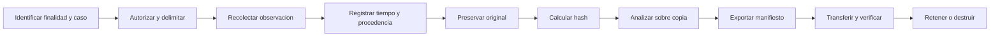

# Evidencia y Cadena de Custodia

Guia inspirada en ISO/IEC 27037 para identificacion, recoleccion, adquisicion y preservacion de evidencia digital potencial. WP MONITOR no certifica cadena de custodia ni determina admisibilidad legal.

## Unidad de trazabilidad

El `Case ID` relaciona:

- caso y autorizacion;
- operador;
- contacto o JID cuando aplica;
- captura de red;
- analisis de llamada;
- Check-In y recibo;
- eventos de auditoria;
- informes y exportaciones.

## Ciclo de evidencia



## Metadata minima

- Case ID y estado;
- operador responsable;
- autorizacion/motivo;
- version del producto;
- modo de despliegue;
- origen de la observacion;
- inicio/fin UTC;
- host/interfaz cuando corresponda;
- filtros utilizados;
- identificador de evidencia;
- hash SHA-256;
- limitaciones y fallos.

## Evidence Package

El paquete puede incluir manifiesto, caso, enlaces de evidencia, auditoria, analisis de llamada, resumen de red, JSON, CSV e informes. Cada seccion o archivo recibe hash para detectar cambios posteriores.

El paquete no debe incluir `DASHBOARD_TOKEN`, `.env`, sesion Baileys, credenciales MongoDB ni payload privado.

## Verificacion

Ejemplo PowerShell:

```powershell
Get-FileHash .\evidence-package.zip -Algorithm SHA256
```

Ejemplo Linux/macOS:

```bash
sha256sum evidence-package.zip
```

Compara con el valor registrado por un canal independiente. Verifica antes y despues de transferir.

## Transferencia

Registra fecha UTC, emisor, receptor, medio, nombre exacto, tamano y hash. Usa cifrado en transito y reposo. No renombres o regenere archivos sin producir una nueva entrada de custodia.

## Diferencia entre integridad y valor probatorio

Un hash correcto demuestra que los bytes no cambiaron desde el calculo. No demuestra:

- quien genero originalmente el dato;
- que un navegador no declaro valores falsos;
- que una IP pertenece a una persona;
- que GeoIP representa la ubicacion fisica;
- que la captura cubrio todo el periodo.

La conclusion debe citar fuente, cobertura, confianza y corroboracion.

## Checklist de cierre

- [ ] Caso y autorizacion completos.
- [ ] Ventana UTC definida.
- [ ] Original preservado.
- [ ] Analisis sobre copia o representacion derivada.
- [ ] Hashes recalculados.
- [ ] Manifiesto legible.
- [ ] Limitaciones visibles.
- [ ] Exportacion registrada en auditoria.
- [ ] Transferencia documentada.
- [ ] Retencion aprobada.
