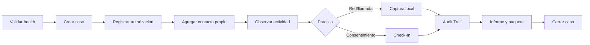

# Guia de Usuario

Esta guia describe el recorrido operativo de WP MONITOR. Antes de utilizar datos reales completa el [Inicio rapido](../getting-started/README.md) y define una autorizacion verificable.

## Navegacion principal

| Pantalla | Objetivo | Guia |
| --- | --- | --- |
| Cases | Abrir, seleccionar y cerrar el expediente | [Casos y Tracker](cases-and-tracker.md) |
| WhatsApp Tracker | Contactos, RTT, presencia, perfiles, llamadas e informes | [Casos y Tracker](cases-and-tracker.md) |
| Network Monitor | Captura local, filtros, estadisticas e IP Tracker | [Red y llamadas](network-and-calls.md) |
| Check-In | Solicitud consentida de datos tecnicos y GPS opcional | [Check-In, auditoria e informes](checkins-audit-reports.md) |
| Audit Trail | Linea de tiempo, filtros y paquete de evidencia | [Check-In, auditoria e informes](checkins-audit-reports.md) |

## Secuencia operativa recomendada

## Reglas de lectura

- `Online`, `Standby` y `Offline` son clasificaciones sobre muestras RTT.
- `Escribiendo`, `Grabando` y estados de llamada son eventos efimeros disponibles para la sesion, no una vigilancia continua garantizada.
- El prefijo telefonico indica numeracion, no ubicacion actual.
- Una IP candidata conserva un score tecnico y limitaciones; no identifica por si sola al contacto.
- `GeoIP` no es `GPS`.
- Un resultado `solo relay` o `sin candidatas` es valido y no debe forzarse.

## Estados globales

| Indicador | Significado |
| --- | --- |
| Server Connected | Socket.IO y API responden |
| WhatsApp Active | La sesion Baileys esta abierta |
| Dashboard Mode | La captura local esta deshabilitada por despliegue |
| Local capture enabled | El backend permite intentar captura; todavia requiere driver y privilegios |

## Antes de entregar un resultado

1. confirma el caso y el operador;
2. revisa UTC y hora local;
3. identifica la fuente de cada afirmacion;
4. declara cobertura y limitaciones;
5. conserva JSON junto con el documento legible;
6. verifica hashes;
7. registra la exportacion y cierra el caso.
