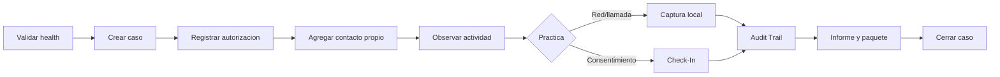

# Guia de Usuario

Esta guia describe el recorrido operativo de WP MONITOR. Antes de utilizar datos reales completa el [Inicio rapido](../getting-started/README.md) y define una autorizacion verificable.

## Navegacion principal

| Pantalla | Objetivo | Guia |
| --- | --- | --- |
| Casos | Abrir, seleccionar y cerrar el expediente | [Casos y actividad](cases-and-tracker.md) |
| Actividad WhatsApp | Contactos, actividad observada, perfiles, llamadas e informes | [Casos y actividad](cases-and-tracker.md) |
| Monitor de red | Captura local, filtros, estadisticas e IP Tracker | [Red y llamadas](network-and-calls.md) |
| Verificacion | Solicitud consentida de datos tecnicos y GPS opcional | [Check-In, auditoria e informes](checkins-audit-reports.md) |
| Auditoria | Linea de tiempo, filtros y paquete de evidencia | [Check-In, auditoria e informes](checkins-audit-reports.md) |
| Cuenta | Cambiar usuario y/o contrasena del operador unico | Esta guia |

## Acceso y cuenta

La primera instalacion crea una sola cuenta desde los secretos de bootstrap. Inicia sesion con usuario y contrasena; el navegador no guarda la contrasena ni un token reutilizable en `localStorage`.

En **Cuenta** puedes cambiar usuario, contrasena o ambos. Debes confirmar la contrasena actual. Al guardar, todas las sesiones HTTP y Socket.IO anteriores quedan revocadas y la sesion actual recibe una cookie nueva. Los valores `INITIAL_ADMIN_*` no restablecen posteriormente la cuenta.

## Secuencia operativa recomendada

## Reglas de lectura

- `Online` y `Standby` son clasificaciones heuristicas sobre muestras RTT; `Calibrando` indica que aun no hay historial suficiente; `Sin ACK` significa que el probe no obtuvo confirmacion y no prueba que el contacto este desconectado; `Sin clasificar` conserva estados historicos o inesperados sin contarlos falsamente como Standby.
- `Escribiendo`, `Grabando` y estados de llamada son eventos efimeros disponibles para la sesion, no una vigilancia continua garantizada.
- El prefijo telefonico indica numeracion, no ubicacion actual.
- Una IP candidata conserva un score tecnico y limitaciones; no identifica por si sola al contacto.
- `GeoIP` no es `GPS`.
- Un resultado `solo relay` o `sin candidatas` es valido y no debe forzarse.

## Estados globales

| Indicador | Significado |
| --- | --- |
| Servidor conectado | Socket.IO y API responden |
| WhatsApp conectado | La sesion Baileys esta abierta |
| Captura local lista | El backend nativo tiene driver y privilegios para el Monitor de red |
| Captura de llamada lista | El agente aislado del navegador VPS responde y puede abrir una ventana autorizada |
| Agente de llamada no disponible | El modo agente esta configurado, pero su readiness no responde; la actividad pasiva sigue operando |
| Captura tecnica desactivada | El despliegue no habilita captura local ni agente de llamadas |

## Antes de entregar un resultado

1. confirma el caso y el operador;
2. revisa UTC y hora local;
3. identifica la fuente de cada afirmacion;
4. declara cobertura y limitaciones;
5. conserva JSON junto con el documento legible;
6. verifica hashes;
7. registra la exportacion y cierra el caso.
